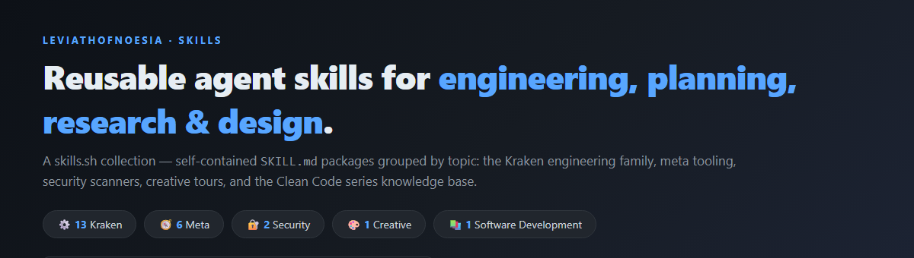
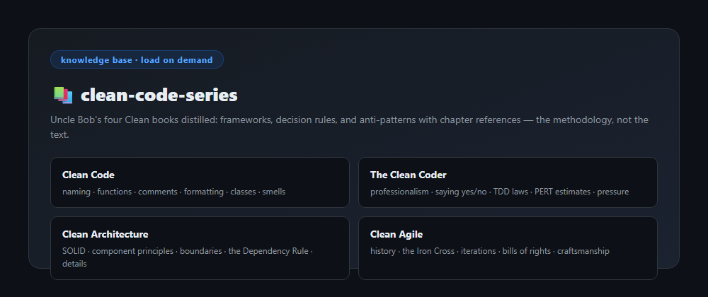
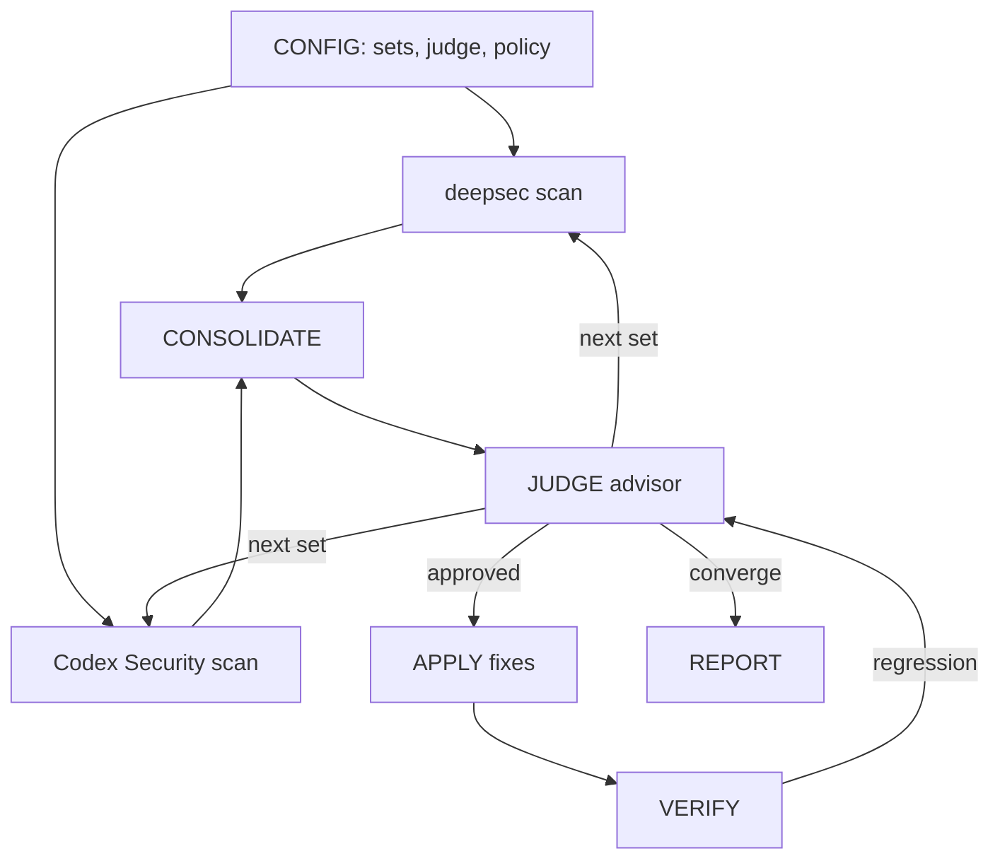

<p align="center">
  
</p>

# Leviath Skills

Reusable agent skills for engineering, planning, research, design, documentation,
and prompt tooling.

[](https://skills.sh/b/leviathofnoesia/skills)

Maintained by [leviathofnoesia](https://github.com/leviathofnoesia).

---

## 📚 Featured — Clean Code Series

<p align="center">
  
</p>

The four Clean books distilled into a load-on-demand knowledge base — the
methodology, not the text. Per-book references with chapter maps and decision
rules.

| Skill | Description |
|-------|-------------|
| [clean-code-series](./software-development/clean-code-series/) | Use when writing clean code or designing architecture. |

---

## Skills

Skills are grouped by topic to avoid collisions as the collection grows. Each
skill lives at `TOPIC/SKILL-NAME/` and is a self-contained package
(`SKILL.md` + optional `scripts/`, `references/`, `assets/`).

### ⚙️ Kraken

Engineering methodology family. A process overlay — load alongside
specialists, not instead. `kraken-engineer` is the universal method; the rest
are specialists (architecture, planning, search, research, design, docs,
constraints, audit, TDD, multimedia analysis, learning-memory).

| Skill | Description |
|-------|-------------|
| [kraken-engineer](./harness/kraken-skill/kraken-engineer/) | Engineering: verifiable steps, TDD, evidence gates. |
| [kraken-architect](./harness/kraken-skill/kraken-architect/) | Architecture: first-principles analysis, evidence audits. |
| [kraken-cartographer](./harness/kraken-skill/kraken-cartographer/) | Planning with correct, complete, verifiable steps. |
| [kraken-nautilus](./harness/kraken-skill/kraken-nautilus/) | Codebase search: systematic, cross-validated exploration. |
| [kraken-abyssal](./harness/kraken-skill/kraken-abyssal/) | External research with every claim version-pinned and cited. |
| [kraken-gauntlet-loop](./harness/kraken-skill/kraken-gauntlet-loop/) | Quality loop: build, blind-critic, rebuild until it wins. |
| [kraken-coral](./harness/kraken-skill/kraken-coral/) | UI design: accessible, design-system-compliant. |
| [kraken-siren](./harness/kraken-skill/kraken-siren/) | Documentation: clear, actionable, quality-checked. |
| [kraken-poseidon](./harness/kraken-skill/kraken-poseidon/) | Pre-planning constraints: surface requirements, boundaries. |
| [kraken-scylla](./harness/kraken-skill/kraken-scylla/) | Plan audit: SOLID and measurable gates before execution. |
| [kraken-blitzkrieg-tdd](./harness/kraken-skill/kraken-blitzkrieg-tdd/) | TDD with evidence-gated completion and red-green-refactor. |
| [kraken-pearl](./harness/kraken-skill/kraken-pearl/) | Multimedia analysis: structured evidence-bound extraction. |
| [kraken-learning](./harness/kraken-skill/kraken-learning/) | Persist and compound learnings after meaningful work. |
| [kraken-git-verify](./harness/kraken-skill/kraken-git-verify/) | Verify repo, branch, remote before any git write. |
| [kraken-prompt-gauntlet](./harness/kraken-skill/kraken-prompt-gauntlet/) | Use when upgrading a raw brief into a build-grade prompt. |

### 🧭 Meta

Prompt utilities and token economy — keep intermediate turns cheap and move
long prompts onto cheaper transports.

| Skill | Description |
|-------|-------------|
| [lean-turns](./meta/lean-turns/) | Lean turns: summary-only intermediates, final full prose. |
| [lean-turns-strict](./meta/lean-turns/lean-turns-strict/) | Ultra-lean turns: summary-only until the final deliverable. |
| [prompt2image](./meta/prompt2image/) | Render a text prompt as a compact monospace PNG image. |
| [prompt2qr](./meta/prompt2qr/) | Compress a prompt and encode it as binary QR PNGs. |
| [ste-writing](./meta/ste-writing/) | Rewrite and check technical text against ASD-STE100 rules. |
| [gauntlet-loop](./meta/gauntlet-loop/) | Build, blind-critic, rebuild until the output wins or ties. |

### 🔐 Security

Deepsec and Codex Security scanning — Luna pins, DeepSeek V4 model variants, and a judge-advised auto-apply orchestrator.

| Skill | Description |
|-------|-------------|
| [deepsec-luna](./security/deepsec-luna/) | Pin deepsec AI runs to Luna for scanning and triage. |
| [deepsec-codex-luna](./security/deepsec-codex-luna/) | Dual-scan with deepsec and Codex Security on Luna. |
| [deepsec-v4-flash](./security/deepsec-v4-flash/) | Scan with deepsec on DeepSeek V4 Flash; ask harness/api. |
| [deepsec-v4-pro](./security/deepsec-v4-pro/) | Scan with deepsec on DeepSeek V4 Pro; ask harness/api. |
| [deepsec-codex-v4-flash](./security/deepsec-codex-v4-flash/) | Dual-scan with deepsec + Codex Security on V4 Flash; ask harness/api. |
| [deepsec-codex-v4-pro](./security/deepsec-codex-v4-pro/) | Dual-scan with deepsec + Codex Security on V4 Pro; ask harness/api. |
| [deepsec-orchestrator](./security/deepsec-orchestrator/) | Loop deepsec + Codex Security via judge; consolidate and auto-apply. |

The `deepsec-orchestrator` runs both scanners through an advisor agent in a
looping graph:



Each security skill also ships a `human.md` guide for people. The guide uses
plain language and diagrams.

### 🎨 Creative

Design and UI quality workflows — guided tours and loops that drive a surface
toward a committed visual bar.

| Skill | Description |
|-------|-------------|
| [auto-impeccable](./creative/auto-impeccable/) | Use when running an auto-impeccable tour of a UI project. |

### 📚 Software Development

Knowledge bases and methodology references for working software engineers.

| Skill | Description |
|-------|-------------|
| [clean-code-series](./software-development/clean-code-series/) | Use when writing clean code or designing architecture. |

---

## Install

Use the [`skills`](https://www.npmjs.com/package/skills) CLI to install from
this repo:

```bash
# Install every skill in the repo
npx skills add leviathofnoesia/skills

# Install a single skill by slug
npx skills add https://github.com/leviathofnoesia/skills --skill <slug>
```

`<slug>` is the skill's `name:` from its `SKILL.md` (e.g. `kraken-engineer`,
`lean-turns`, `prompt2qr`).

Flags:

- Install for the user (not the project): add `-g`.
- Target specific agents: add `--agent claude-code cursor`.

Manual fallback (symlink into your harness skills path):

```bash
ln -s "$PWD/harness/kraken-skill/kraken-engineer" ~/.claude/skills/kraken-engineer
```

## Generated index

[`index.md`](./index.md) is the compact, generated catalog of every `SKILL.md` in
this repository. It gives agents a fast overview of each skill and keeps the
full source path available for retrieval; the index is a map, not a replacement
for reading the linked skill.

The index is produced by
[`skill-compiler`](https://github.com/leviathofnoesia/skill-compiler)'s
`marketplace` command:

```bash
npx --yes github:leviathofnoesia/skill-compiler marketplace --dir . --out index.md
```

The repository's GitHub Actions workflow regenerates `index.md` on pushes that
change a `SKILL.md`, then commits the generated result when it changes. To
preview or verify locally:

```bash
npx --yes github:leviathofnoesia/skill-compiler marketplace --dir . --dry-run
npx --yes github:leviathofnoesia/skill-compiler marketplace --dir . --check
```

## License

Unless noted otherwise in a skill folder, content is available for use with AI
coding agents. Attribution appreciated.
