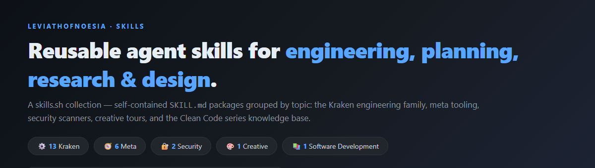
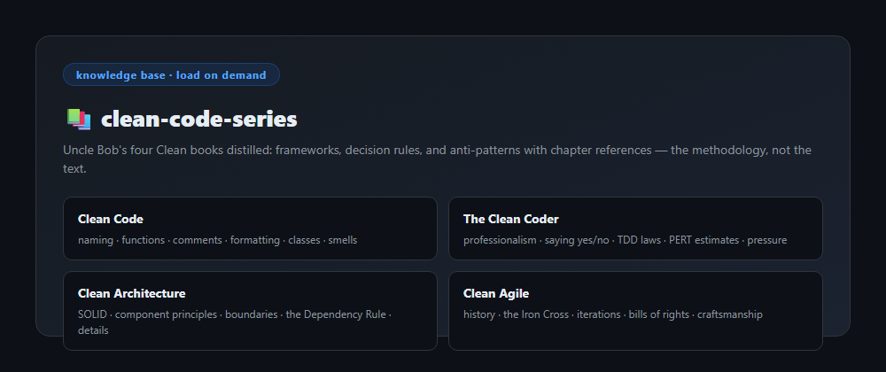
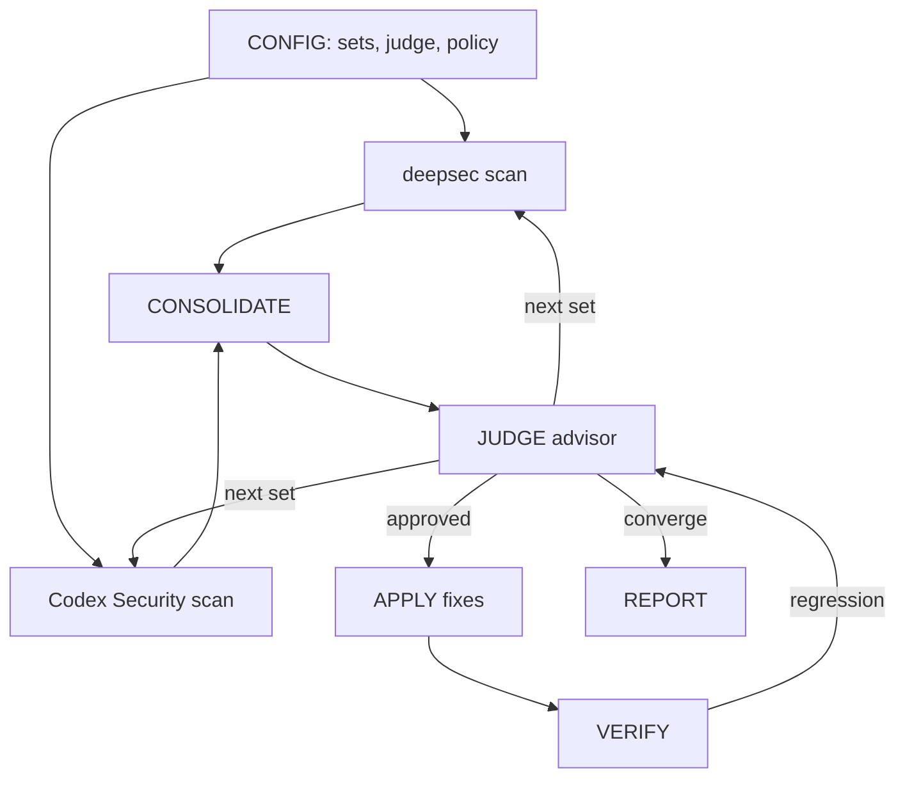
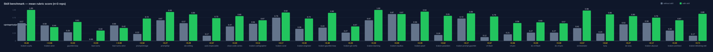

<p align="center">
  
</p>

# Leviath Skills

Reusable agent skills for engineering, planning, research, design, documentation,
and prompt tooling.

[](https://skills.sh/b/leviathofnoesia/skills)

Maintained by [leviathofnoesia](https://github.com/leviathofnoesia).

---

## 📚 Featured — Clean Code Series

<p align="center">
  
</p>

The four Clean books distilled into a load-on-demand knowledge base — the
methodology, not the text. Per-book references with chapter maps and decision
rules.

| Skill | Description |
|-------|-------------|
| [clean-code-series](./software-development/clean-code-series/) | Use when writing clean code or designing architecture. |

---

## Skills

Skills are grouped by topic to avoid collisions as the collection grows. Each
skill lives at `TOPIC/SKILL-NAME/` and is a self-contained package
(`SKILL.md` + optional `scripts/`, `references/`, `assets/`).

### ⚙️ Kraken

Engineering methodology family. A process overlay — load alongside
specialists, not instead. `kraken-engineer` is the universal method; the rest
are specialists (architecture, planning, search, research, design, docs,
constraints, audit, TDD, multimedia analysis, learning-memory).

| Skill | Description |
|-------|-------------|
| [kraken-engineer](./harness/kraken-skill/kraken-engineer/) | Engineering: verifiable steps, TDD, evidence gates. |
| [kraken-architect](./harness/kraken-skill/kraken-architect/) | Architecture: first-principles analysis, evidence audits. |
| [kraken-cartographer](./harness/kraken-skill/kraken-cartographer/) | Planning with correct, complete, verifiable steps. |
| [kraken-nautilus](./harness/kraken-skill/kraken-nautilus/) | Codebase search: systematic, cross-validated exploration. |
| [kraken-abyssal](./harness/kraken-skill/kraken-abyssal/) | External research with every claim version-pinned and cited. |
| [kraken-gauntlet-loop](./harness/kraken-skill/kraken-gauntlet-loop/) | Quality loop: build, blind-critic, rebuild until it wins. |
| [kraken-coral](./harness/kraken-skill/kraken-coral/) | UI design: accessible, design-system-compliant. |
| [kraken-siren](./harness/kraken-skill/kraken-siren/) | Documentation: clear, actionable, quality-checked. |
| [kraken-poseidon](./harness/kraken-skill/kraken-poseidon/) | Pre-planning constraints: surface requirements, boundaries. |
| [kraken-scylla](./harness/kraken-skill/kraken-scylla/) | Plan audit: SOLID and measurable gates before execution. |
| [kraken-blitzkrieg-tdd](./harness/kraken-skill/kraken-blitzkrieg-tdd/) | TDD with evidence-gated completion and red-green-refactor. |
| [kraken-pearl](./harness/kraken-skill/kraken-pearl/) | Multimedia analysis: structured evidence-bound extraction. |
| [kraken-learning](./harness/kraken-skill/kraken-learning/) | Persist and compound learnings after meaningful work. |
| [kraken-git-verify](./harness/kraken-skill/kraken-git-verify/) | Verify repo, branch, remote before any git write. |
| [kraken-prompt-gauntlet](./harness/kraken-skill/kraken-prompt-gauntlet/) | Use when upgrading a raw brief into a build-grade prompt. |

### 🧭 Meta

Prompt utilities and token economy — keep intermediate turns cheap and move
long prompts onto cheaper transports.

| Skill | Description |
|-------|-------------|
| [lean-turns](./meta/lean-turns/) | Lean turns: summary-only intermediates, final full prose. |
| [lean-turns-strict](./meta/lean-turns/lean-turns-strict/) | Ultra-lean turns: summary-only until the final deliverable. |
| [context-budget](./meta/context-budget/) | Plan long agent tasks around the context window: checkpoint, reload, compact. |
| [log-mining](./meta/log-mining/) | Extract signal from large logs: triage, window around errors, correlate. |
| [prompt2image](./meta/prompt2image/) | Render a text prompt as a compact monospace PNG image. |
| [prompt2qr](./meta/prompt2qr/) | Compress a prompt and encode it as binary QR PNGs. |
| [ste-writing](./meta/ste-writing/) | Rewrite and check technical text against ASD-STE100 rules. |
| [gauntlet-loop](./meta/gauntlet-loop/) | Build, blind-critic, rebuild until the output wins or ties. |

### 🔐 Security

Deepsec and Codex Security scanning — Luna pins, DeepSeek V4 model variants, and a judge-advised auto-apply orchestrator.

| Skill | Description |
|-------|-------------|
| [deepsec-luna](./security/deepsec-luna/) | Pin deepsec AI runs to Luna for scanning and triage. |
| [deepsec-codex-luna](./security/deepsec-codex-luna/) | Dual-scan with deepsec and Codex Security on Luna. |
| [deepsec-v4-flash](./security/deepsec-v4-flash/) | Scan with deepsec on DeepSeek V4 Flash; ask harness/api. |
| [deepsec-v4-pro](./security/deepsec-v4-pro/) | Scan with deepsec on DeepSeek V4 Pro; ask harness/api. |
| [deepsec-codex-v4-flash](./security/deepsec-codex-v4-flash/) | Dual-scan with deepsec + Codex Security on V4 Flash; ask harness/api. |
| [deepsec-codex-v4-pro](./security/deepsec-codex-v4-pro/) | Dual-scan with deepsec + Codex Security on V4 Pro; ask harness/api. |
| [deepsec-orchestrator](./security/deepsec-orchestrator/) | Loop deepsec + Codex Security via judge; consolidate and auto-apply. |

The `deepsec-orchestrator` runs both scanners through an advisor agent in a
looping graph:


```mermaid
flowchart TD
    CFG[CONFIG: sets, judge, policy] --> SD[deepsec scan]
    CFG --> SC[Codex Security scan]
    SD --> CON[CONSOLIDATE]
    SC --> CON
    CON --> J[JUDGE advisor]
    J -->|approved| A[APPLY fixes]
    A --> V[VERIFY]
    V -->|regression| J
    J -->|next set| SD
    J -->|next set| SC
    J -->|converge| R[REPORT]
```

Each security skill also ships a `human.md` guide for people. The guide uses
plain language and diagrams.

### Which skill?

| You want to… | Use |
|---|---|
| Scan one codebase with deepsec on DeepSeek V4 Flash | [deepsec-v4-flash](./security/deepsec-v4-flash/) |
| Scan one codebase with deepsec on DeepSeek V4 Pro | [deepsec-v4-pro](./security/deepsec-v4-pro/) |
| Scan with deepsec **and** Codex Security on V4 Flash | [deepsec-codex-v4-flash](./security/deepsec-codex-v4-flash/) |
| Scan with deepsec **and** Codex Security on V4 Pro | [deepsec-codex-v4-pro](./security/deepsec-codex-v4-pro/) |
| Automate the whole loop — scan → judge → fix → repeat | [deepsec-orchestrator](./security/deepsec-orchestrator/) |
| Run deepsec pinned to the Luna model (gpt-5.6-luna) | [deepsec-luna](./security/deepsec-luna/) / [deepsec-codex-luna](./security/deepsec-codex-luna/) |

The four DeepSeek skills share one rule: they never hardcode a harness or API —
they ask you first. The orchestrator wraps the scanners in a loop with an
advisor agent that consolidates and auto-applies findings.

### Measured impact

Every skill in this repo was benchmarked with/without on a clean base agent
(no skills, no tools; deterministic per-skill rubric; n=3 per arm). Full
per-skill charts live in each skill's `human.md`.



| Skill | Without | With | Δ |
|---|---|---|---|
| kraken-blitzkrieg-tdd | 0.17 | 0.88 | +0.71 |
| deepsec-v4-flash | 0.12 | 0.79 | +0.67 |
| deepsec-luna | 0.24 | 0.86 | +0.62 |
| kraken-poseidon | 0.19 | 0.81 | +0.62 |
| deepsec-orchestrator | 0.41 | 0.98 | +0.57 |
| auto-impeccable | 0.17 | 0.73 | +0.57 |
| prompt2image | 0.22 | 0.72 | +0.50 |
| kraken-gauntlet-loop | 0.43 | 0.90 | +0.48 |
| kraken-scylla | 0.57 | 1.00 | +0.43 |
| kraken-pearl | 0.56 | 0.94 | +0.39 |
| deepsec-v4-pro | 0.21 | 0.58 | +0.36 |
| clean-code-series | 0.47 | 0.80 | +0.33 |
| gauntlet-loop | 0.28 | 0.61 | +0.33 |
| kraken-learning | 0.67 | 1.00 | +0.33 |
| kraken-engineer | 0.39 | 0.72 | +0.33 |
| lean-turns | 0.00 | 0.33 | +0.33 |
| kraken-architect | 0.33 | 0.67 | +0.33 |
| deepsec-codex-v4-flash | 0.27 | 0.60 | +0.33 |
| deepsec-codex-v4-pro | 0.27 | 0.57 | +0.30 |
| ste-writing | 0.57 | 0.86 | +0.29 |
| deepsec-codex-luna | 0.53 | 0.80 | +0.27 |
| prompt2qr | 0.67 | 0.93 | +0.27 |
| kraken-git-verify | 0.27 | 0.47 | +0.20 |
| kraken-prompt-gauntlet | 0.72 | 0.89 | +0.17 |
| kraken-coral | 0.75 | 0.92 | +0.17 |
| kraken-abyssal | 0.58 | 0.75 | +0.17 |
| kraken-cartographer | 0.56 | 0.67 | +0.11 |
| kraken-nautilus | 0.87 | 0.87 | +0.00 |
| kraken-siren | 0.50 | 0.44 | −0.06 |
| lean-turns-strict | 0.50 | 0.42 | −0.08 |

Mean delta +0.33 across 30 skills; 27 of 30 positive. The three flat/negative
results are honest: `kraken-nautilus` (the base model already does systematic
code search well), `kraken-siren` and `lean-turns-strict` (the task did not
bind to the skill's specific rules).

Benchmarks run with internal tooling; the methodology (SkillsBench-style
with/without A/B, deterministic rubric grading) is described in each
`human.md`.

### 🎨 Creative

Design and UI quality workflows — guided tours and loops that drive a surface
toward a committed visual bar.

| Skill | Description |
|-------|-------------|
| [auto-impeccable](./creative/auto-impeccable/) | Use when running an auto-impeccable tour of a UI project. |

### 📚 Software Development

Knowledge bases and methodology references for working software engineers.

| Skill | Description |
|-------|-------------|
| [clean-code-series](./software-development/clean-code-series/) | Use when writing clean code or designing architecture. |
| [agent-sanctuary](./software-development/agent-sanctuary/) | Install and apply engineering-lifecycle skills from Agent Sanctuary. |
| [diff-explain](./software-development/diff-explain/) | Explain diffs/PRs as layered summaries for reviewers. |
| [api-contract-diff](./software-development/api-contract-diff/) | Detect breaking changes between API versions. |
| [dep-upgrade-audit](./software-development/dep-upgrade-audit/) | Upgrade a dependency safely with changelog audit and staged bump. |
| [flaky-test-triage](./software-development/flaky-test-triage/) | Diagnose flaky tests: ordering, timing, environment causes. |
| [env-repro](./software-development/env-repro/) | Reproduce environment-specific bugs by diffing OS/version/config. |

---

## Install

Use the [`skills`](https://www.npmjs.com/package/skills) CLI to install from
this repo:

```bash
# Install every skill in the repo
npx skills add leviathofnoesia/skills

# Install a single skill by slug
npx skills add https://github.com/leviathofnoesia/skills --skill <slug>
```

`<slug>` is the skill's `name:` from its `SKILL.md` (e.g. `kraken-engineer`,
`lean-turns`, `prompt2qr`).

Flags:

- Install for the user (not the project): add `-g`.
- Target specific agents: add `--agent claude-code cursor`.

Manual fallback (symlink into your harness skills path):

```bash
ln -s "$PWD/harness/kraken-skill/kraken-engineer" ~/.claude/skills/kraken-engineer
```

## Generated index

[`index.md`](./index.md) is the compact, generated catalog of every `SKILL.md` in
this repository. It gives agents a fast overview of each skill and keeps the
full source path available for retrieval; the index is a map, not a replacement
for reading the linked skill.

The index is produced by
[`skill-compiler`](https://github.com/leviathofnoesia/skill-compiler)'s
`marketplace` command:

```bash
npx --yes github:leviathofnoesia/skill-compiler marketplace --dir . --out index.md
```

The repository's GitHub Actions workflow regenerates `index.md` on pushes that
change a `SKILL.md`, then commits the generated result when it changes. To
preview or verify locally:

```bash
npx --yes github:leviathofnoesia/skill-compiler marketplace --dir . --dry-run
npx --yes github:leviathofnoesia/skill-compiler marketplace --dir . --check
```

## License

Unless noted otherwise in a skill folder, content is available for use with AI
coding agents. Attribution appreciated.

## Skills Library (v2 expansion)

88 additional skills across six families. Full index below.

### Software Development (`software-development/`)

| Skill | Description |
|-------|-------------|
| [dead-code-sweep](./software-development/dead-code-sweep/) | Find and safely remove dead code with call-graph evidence. |
| [error-taxonomy-design](./software-development/error-taxonomy-design/) | Design consistent error types and codes across a codebase. |
| [contract-test-bootstrap](./software-development/contract-test-bootstrap/) | Stand up consumer-driven contract tests between two services. |
| [perf-budget-guardian](./software-development/perf-budget-guardian/) | Set and enforce performance budgets in CI with regression alerts. |
| [feature-flag-lifecycle](./software-development/feature-flag-lifecycle/) | Manage feature flags: naming, expiry, cleanup, kill switches. |
| [migration-planner](./software-development/migration-planner/) | Plan zero-downtime schema migrations with reversible steps. |
| [api-versioning-strategy](./software-development/api-versioning-strategy/) | Choose and implement an API versioning scheme that ages well. |
| [code-archaeology](./software-development/code-archaeology/) | Reconstruct why legacy code exists using git history and docs. |
| [refactor-safe-extract](./software-development/refactor-safe-extract/) | Extract functions/classes behaviorally with seam-first testing. |
| [test-data-builder-pattern](./software-development/test-data-builder-pattern/) | Replace brittle test fixtures with composable builder factories. |
| [chaos-drill-lite](./software-development/chaos-drill-lite/) | Run small controlled failure drills against your own service. |
| [observability-checklist](./software-development/observability-checklist/) | Audit a service for metrics, logs, traces before it ships. |
| [dependency-license-audit](./software-development/dependency-license-audit/) | Inventory dependency licenses and flag copyleft/commercial risk. |
| [monorepo-split-plan](./software-development/monorepo-split-plan/) | Plan extracting a package from a monorepo without breaking CI. |
| [sdk-design-review](./software-development/sdk-design-review/) | Review a public SDK/API surface for ergonomics and stability. |
| [incident-postmortem-writer](./software-development/incident-postmortem-writer/) | Write blameless postmortems with timelines and action items. |
| [backlog-triage-grooming](./software-development/backlog-triage-grooming/) | Turn a stale issue backlog into a ranked, actionable queue. |
| [pr-description-forge](./software-development/pr-description-forge/) | Write PR descriptions reviewers actually need: intent, risk, test. |
| [type-boundary-hardening](./software-development/type-boundary-hardening/) | Introduce strict types at module boundaries incrementally. |
| [load-test-from-logs](./software-development/load-test-from-logs/) | Build realistic load profiles by replaying production traffic shapes. |

### Meta / Agent Operations (`meta/`)

| Skill | Description |
|-------|-------------|
| [prompt-contract-authoring](./meta/prompt-contract-authoring/) | Write explicit input/output contracts for reusable prompts. |
| [context-pruning-pass](./meta/context-pruning-pass/) | Drop stale conversation context before long tasks to save budget. |
| [tool-choice-arbiter](./meta/tool-choice-arbiter/) | Pick the cheapest sufficient tool for each subtask step. |
| [verification-chain-builder](./meta/verification-chain-builder/) | Chain claims to checks: every assertion gets a verification step. |
| [assumption-ledger](./meta/assumption-ledger/) | Track assumptions explicitly and revisit them before shipping. |
| [scope-fence](./meta/scope-fence/) | Detect and stop scope creep mid-task with a written fence. |
| [failure-mode-catalog](./meta/failure-mode-catalog/) | Enumerate how this task can fail before starting it. |
| [progress-heartbeat](./meta/progress-heartbeat/) | Emit structured progress notes during long autonomous runs. |
| [self-critique-loop](./meta/self-critique-loop/) | Adversarially review own output against the original ask. |
| [instruction-decompiler](./meta/instruction-decompiler/) | Rewrite vague requests into explicit, checkable instructions. |
| [artifact-lineage](./meta/artifact-lineage/) | Record which files/artifacts produced which outputs and why. |
| [decision-record-mini](./meta/decision-record-mini/) | Lightweight ADRs: decision, options considered, why, revert path. |
| [token-budget-forecast](./meta/token-budget-forecast/) | Estimate token cost of a plan before executing it. |
| [retry-policy-designer](./meta/retry-policy-designer/) | Choose retry/backoff/timeout policies per external dependency. |
| [checklist-compiler](./meta/checklist-compiler/) | Compile recurring workflows into executable checklists. |

### Research (`research/`)

| Skill | Description |
|-------|-------------|
| [source-triangulation](./research/source-triangulation/) | Verify a claim against three independent source classes. |
| [literature-scan](./research/literature-scan/) | Rapid structured scan of a field: key papers, authors, debates. |
| [claim-decay-checker](./research/claim-decay-checker/) | Check if a cited fact is superseded or retracted. |
| [competitive-teardown](./research/competitive-teardown/) | Systematic product teardown: positioning, pricing, moat, gaps. |
| [primary-source-hunter](./research/primary-source-hunter/) | Trace claims back to primary sources instead of aggregators. |
| [survey-question-design](./research/survey-question-design/) | Design survey questions that avoid bias and leading frames. |
| [dataset-provenance](./research/dataset-provenance/) | Document where data came from and what licenses apply. |
| [experiment-power-check](./research/experiment-power-check/) | Sanity-check sample size and effect size before running tests. |
| [citation-graph-walk](./research/citation-graph-walk/) | Follow citation chains forward/backward to map a topic's core. |
| [expert-interview-prep](./research/expert-interview-prep/) | Prepare interview scripts with open questions and probes. |
| [market-sizing-sanity](./research/market-sizing-sanity/) | TAM/SAM/SOM estimates with stated assumptions and ranges. |
| [patent-landscape-lite](./research/patent-landscape-lite/) | Sketch the patent landscape around a mechanism or domain. |
| [reproducibility-audit](./research/reproducibility-audit/) | Check whether published results can be reproduced from artifacts. |
| [synthesis-matrix](./research/synthesis-matrix/) | Merge many sources into a claim-by-source evidence matrix. |
| [unknown-unknowns-scan](./research/unknown-unknowns-scan/) | List what the research plan is NOT covering and why that matters. |

### Writing & Communication (`writing/`)

| Skill | Description |
|-------|-------------|
| [style-guide-distiller](./writing/style-guide-distiller/) | Extract a project's voice rules from existing copy samples. |
| [changelog-narrator](./writing/changelog-narrator/) | Turn diff sets into user-facing changelog entries. |
| [api-doc-sketcher](./writing/api-doc-sketcher/) | Draft reference docs from real signatures and call sites. |
| [tutorial-scaffolder](./writing/tutorial-scaffolder/) | Structure tutorials: promise, steps, checkpoints, payoff. |
| [release-note-editor](./writing/release-note-editor/) | Edit raw notes into scannable release communications. |
| [blog-post-outline](./writing/blog-post-outline/) | Outline posts with argument flow and evidence slots. |
| [email-brevity-pass](./writing/email-brevity-pass/) | Compress professional email while keeping asks explicit. |
| [onboarding-doc-audit](./writing/onboarding-doc-audit/) | Audit onboarding docs against a newcomer's actual first day. |
| [terminology-consistency](./writing/terminology-consistency/) | Enforce one term per concept across a doc set. |
| [readme-doctor](./writing/readme-doctor/) | Diagnose READMEs: missing promise, install friction, stale bits. |
| [interview-story-framer](./writing/interview-story-framer/) | Shape experience into STAR-format stories with metrics. |
| [translation-handoff-kit](./writing/translation-handoff-kit/) | Package copy for translators: context, glossary, constraints. |

### Data Engineering (`data/`)

| Skill | Description |
|-------|-------------|
| [schema-drift-detector](./data/schema-drift-detector/) | Detect silent schema drift between environments or snapshots. |
| [null-pandemic-audit](./data/null-pandemic-audit/) | Quantify and root-cause null inflation across tables/columns. |
| [join-cardinality-check](./data/join-cardinality-check/) | Verify expected row counts before/after joins to catch fan-out. |
| [timezone-normalizer](./data/timezone-normalizer/) | Find and fix mixed timezone storage and rendering bugs. |
| [pii-scanner](./data/pii-scanner/) | Locate PII leaking into logs, fixtures, and exports. |
| [backfill-planner](./data/backfill-planner/) | Plan safe historical backfills with idempotent batches. |
| [metric-definition-sheet](./data/metric-definition-sheet/) | One canonical definition per metric with formula and owner. |
| [dashboard-critique](./data/dashboard-critique/) | Review dashboards: question first, chart honesty, load speed. |
| [csv-hygiene](./data/csv-hygiene/) | Repair encoding, quoting, and type-coercion issues in CSVs. |
| [sample-before-model](./data/sample-before-model/) | Profile distributions and leakage before any modeling. |
| [event-schema-versioning](./data/event-schema-versioning/) | Version analytics events so downstream queries never break. |
| [anomaly-context-pack](./data/anomaly-context-pack/) | Pair each anomaly alert with the context needed to triage it. |

### DevOps & Reliability (`devops/`)

| Skill | Description |
|-------|-------------|
| [runbook-author](./devops/runbook-author/) | Write runnable runbooks: symptoms, checks, actions, rollback. |
| [ci-flake-quarantine](./devops/ci-flake-quarantine/) | Quarantine flaky CI jobs without losing signal. |
| [env-parity-audit](./devops/env-parity-audit/) | Diff dev/staging/prod config and surface drift. |
| [secret-rotation-playbook](./devops/secret-rotation-playbook/) | Rotate credentials with zero downtime and verified cutover. |
| [cost-anomaly-hunt](./devops/cost-anomaly-hunt/) | Trace cloud bill spikes to specific services and causes. |
| [deploy-freeze-discipline](./devops/deploy-freeze-discipline/) | Implement freeze windows with exception tracking. |
| [log-retention-tuner](./devops/log-retention-tuner/) | Right-size log retention vs cost vs debugging need. |
| [health-endpoint-design](./devops/health-endpoint-design/) | Design liveness/readiness endpoints that tell the truth. |
| [capacity-headroom-check](./devops/capacity-headroom-check/) | Measure headroom before traffic events; set scaling triggers. |
| [backup-restore-drill](./devops/backup-restore-drill/) | Actually restore from backup and time it; prove RTO/RPO. |
| [infra-tagging-standard](./devops/infra-tagging-standard/) | Enforce resource tagging for ownership and cost allocation. |
| [oncall-transition-kit](./devops/oncall-transition-kit/) | Structured handoffs: open incidents, risks, quiet wins. |
| [config-change-journal](./devops/config-change-journal/) | Journal every manual infra change with who/why/revert. |
| [local-dev-bootstrap](./devops/local-dev-bootstrap/) | Make 'clone to running' under 10 minutes with one command. |
