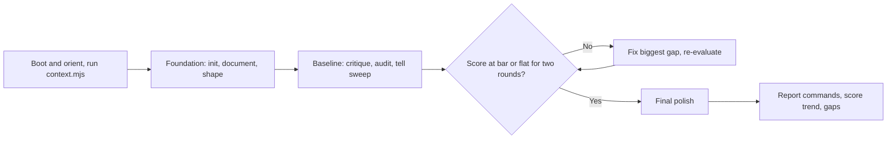
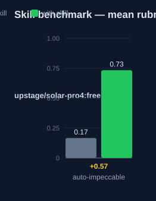

# auto-impeccable — Human Guide

This skill runs a guided tour of a UI project with the full impeccable
command list. The impeccable skill does the work. This skill sets the order.

## What this skill does

The skill walks the 23 impeccable commands in dependency order. It runs each
command only when project-state signals ask for it. The tour has six phases.
Phase 0 boots the project and runs `context.mjs`. Phase 1 builds the
foundation with `init`, `document`, or `shape`. Phase 2 sets a baseline with
`critique`, `audit`, and the tell sweep. Phase 3 loops: fix the biggest gap,
then re-evaluate. It stops after three rounds, or when the normalized score
is flat for two rounds, or when the bar is met. Phase 4 ends with `polish`.
Phase 5 is optional live iteration. Every command must follow its own
impeccable reference. This skill never skips a command playbook.

## Why use this skill

Use this skill when the user says "run the full impeccable tour" or
"auto-impeccable". Use it when the user wants one surface refined
start-to-finish without hand-picking commands. The tour reads real signals,
such as the critique score, the audit findings, and the tell sweep, so it
runs only the commands the project needs.

## When not to use

Do not use this skill for one explicit command. Run that command directly.
Do not use it for backend-only work or non-UI work. Do not use it when the
user wants to pick commands from the interactive menu. That is the
no-argument impeccable menu.

## How the skill works

## Measured impact

We ran a with/without benchmark. A clean base agent got the task. The base
agent has no skills and no tools. The same agent then got the task with this
skill's documentation. A deterministic rubric scored each answer. We ran each
arm three times.

| Arm | Score |
|---|---|
| Without skill | 0.17 |
| With skill | **0.73** (+0.57) |

Method: SkillsBench-style A/B. The model is upstage/solar-pro4:free. The rubric and the
runner stay internal. Any clean base agent with the same prompts can
reproduce these results.
