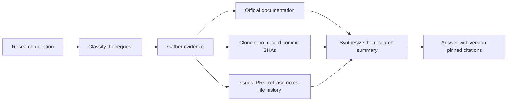
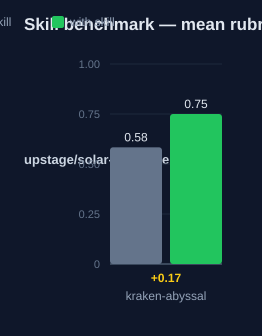

# kraken-abyssal — Human Guide

This skill answers questions about external libraries and frameworks with cited evidence. Every claim links to a permanent, version-pinned source.

## What this skill does

The skill sorts the request into one of five types: conceptual,
implementation, historical, comparative, or fault finding. It then applies
the method that fits that type. Examples: how to use a library. How a library
implements a feature. Library A versus library B. Why a failure happens.
Version history. Each type has a main method: documentation synthesis, source code analysis, version-control analysis, feature analysis, or root-cause analysis. The skill then gathers information. It locates official documentation. It clones the source repository to a temporary directory and records commit SHAs. It reads issues, pull requests, release notes, and file history. The last step builds a research summary. Each finding shows a permanent link, the code or documentation text, and an explanation. The summary ends with version information, recommendations, and open questions.

## Why use this skill

Use this skill for questions about code outside your repository. Examples: how to use a library, how the library implements a feature, library A versus library B, why a failure happens, and version history. The citation rules make each claim checkable. Links use commit SHAs, not branch names, so they do not break. A reader can verify every answer at the source. This supports safe decisions on dependencies and designs.

## When not to use

Do not use this skill for questions about your own repository. Local code search fits better there. Do not use it for opinion, taste, or creative work with no source to cite. Do not use it when the user needs a fast answer and asks for no sources.

## How the skill works

## Measured impact

We ran a with/without benchmark. A clean base agent got the task. The base
agent has no skills and no tools. The same agent then got the task with this
skill's documentation. A deterministic rubric scored each answer. We ran each
arm three times.

| Arm | Score |
|---|---|
| Without skill | 0.58 |
| With skill | **0.75** (+0.17) |

Method: SkillsBench-style A/B. The model is upstage/solar-pro4:free. The rubric and the
runner stay internal. Any clean base agent with the same prompts can
reproduce these results.
