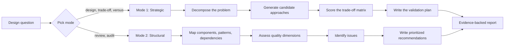
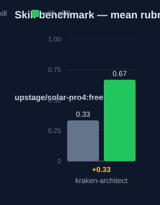

# kraken-architect — Human Guide

This skill analyzes architecture and design questions. It gives evidence-backed recommendations. It does not write the implementation.

## What this skill does

The skill has two modes. Mode 1 is strategic analysis. It decomposes the problem into objectives, constraints, success criteria, and assumptions. It generates candidate approaches. It scores them with a weighted decision matrix. When top scores are within 15%, it picks the simpler option. It ends with a validation plan: test strategy, rollback criteria, and success metrics. Mode 2 is structural analysis. It maps components, patterns, and dependencies. It rates cohesion, coupling, modularity, extensibility, and maintainability. It names issues as structural, dependency, or design. It gives prioritized recommendations with a migration path. Every claim needs code evidence at a file and line, or a first-principles derivation.

## Why use this skill

Use Mode 1 for design decisions and trade-offs. Trigger words: architecture, design, structure, pattern, trade-off, decision, approach, versus. Use Mode 2 for reviews and audits. Trigger words: review, audit, analyze code, assess, evaluate. The skill separates analysis from implementation. It forces evidence for each claim. The output has priorities and a migration path, so a team can act on it.

## When not to use

Do not use this skill for implementation work. Write the code with a normal engineering flow instead. Do not use it for research on external libraries; kraken-abyssal fits that. When a request mixes both modes, ask which mode to apply. Do not use it when the user wants a quick opinion with no evidence.

## How the skill works

## Measured impact

We ran a with/without benchmark. A clean base agent got the task. The base
agent has no skills and no tools. The same agent then got the task with this
skill's documentation. A deterministic rubric scored each answer. We ran each
arm three times.

| Arm | Score |
|---|---|
| Without skill | 0.33 |
| With skill | **0.67** (+0.33) |

Method: SkillsBench-style A/B. The model is upstage/solar-pro4:free. The rubric and the
runner stay internal. Any clean base agent with the same prompts can
reproduce these results.
