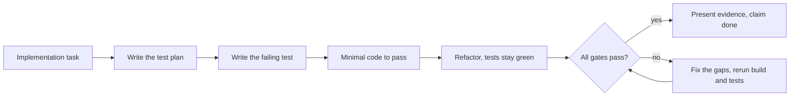
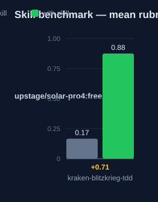

# kraken-blitzkrieg-tdd: Human Guide

This skill enforces test-driven development with completion gates. A task counts as done only when real test evidence exists.

## What this skill does

The skill has four rules. Rule 1: write a test plan before implementation code. The plan lists happy-path, edge-case, error-path, and integration tests. It states a coverage target. The default target is 80%. Rule 2: follow red, green, refactor. Write the failing test first. Make it pass with the minimal change. Then refactor while the tests stay green. Behavior changes need a test. Pure refactors need no new test, but the tests must stay green. Rule 3: gate completion on evidence. A green build must be shown. Executed tests must have real assertions.
Coverage must be at or above the target. The tests must cover the edge cases. A violation checklist blocks the claim of done. The list: build failed. No test run. No assertions. Low coverage. No edge cases. No evidence. Rule 4: keep plan steps atomic. Each plan with implementation steps has a test step and a verification step. Split any step above complexity 3 on a 1 to 10 scale.

## Why use this skill

Use this skill on any implementation task. It stops two common failures: code without tests, and claims of done without proof. The gates are self-enforced. Run them as a checklist at the end of each task. If a gate fails, state the failure. Do not claim success.

## When not to use

Do not use this skill for documentation or research tasks with no code. Do not use it for throwaway scripts with no behavior to protect. Treat the thresholds as defaults; a project may set its own. The skill cannot intercept tool calls. You must apply the rules yourself.

## How the skill works

## Measured impact

We ran a with/without benchmark. A clean base agent got the task. The base
agent has no skills and no tools. The same agent then got the task with this
skill's documentation. A deterministic rubric scored each answer. We ran each
arm three times.

| Arm | Score |
|---|---|
| Without skill | 0.17 |
| With skill | **0.88** (+0.71) |

Method: SkillsBench-style A/B. The model is upstage/solar-pro4:free. The rubric and the
runner stay internal. Any clean base agent with the same prompts can
reproduce these results.
