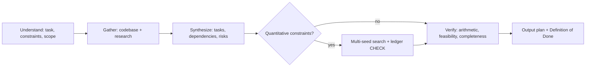
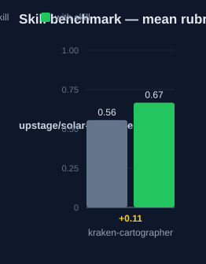

# kraken-cartographer: Human Guide

This skill produces work plans. A good plan is correct, complete, and
verifiable. The skill forces four phases before any plan is output.

## What this skill does

The skill turns a task into a plan in four phases. Phase 1 states what is
asked, the work type, the hard constraints, and the scope limits. Phase 2
gathers facts with codebase tools and external research. Phase 3 breaks the
work into phases, tasks, dependencies, time estimates, and risks. Phase 4
verifies the plan: arithmetic, feasibility, completeness, dependencies, and
ambiguity.

For budget or time problems, the skill adds a quantitative module. That module
lists all items and limits, searches five seed solutions, improves each with
swap passes, and outputs a ledger with a CHECK assertion. The plan is invalid
if the CHECK fails.

## Why use this skill

Use this skill for any non-trivial plan: a new feature, a refactor, a bug
fix, a migration, an investigation, or a budget-limited selection. Use it when
a wrong plan costs more than a slow plan. Compose it with kraken-engineer for
process control.

## When not to use

Do not use this skill for trivial tasks that need one step. Do not use it when
you need code, not a plan: use `kraken-blitzkrieg-tdd`. Do not use it for
architecture trade-off decisions: use `kraken-architect`.

## How the skill works

## Measured impact

We ran a with/without benchmark. A clean base agent got the task. The base
agent has no skills and no tools. The same agent then got the task with this
skill's documentation. A deterministic rubric scored each answer. We ran each
arm three times.

| Arm | Score |
|---|---|
| Without skill | 0.56 |
| With skill | **0.67** (+0.11) |

Method: SkillsBench-style A/B. The model is upstage/solar-pro4:free. The rubric and the
runner stay internal. Any clean base agent with the same prompts can
reproduce these results.
