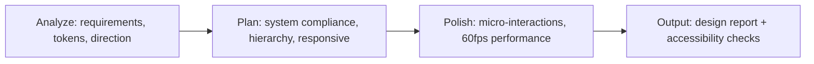
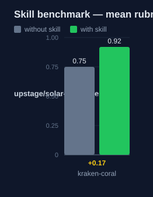

# kraken-coral — Human Guide

This skill changes the visual layer of a user interface. It makes the
interface accessible and consistent with the design system. It never touches
business logic.

## What this skill does

The skill takes functional requirements and turns them into a visual design
in three phases. Phase 1 records the requirements, the existing design tokens,
and the design direction. Phase 2 plans the changes: design-system compliance,
visual hierarchy, and responsive rules. Phase 3 adds micro-interactions and
keeps animations at 60fps.

The skill outputs a fixed report: design approach, changes applied with file
paths, visual details, responsive behavior, and accessibility checks.

## Why use this skill

Use this skill for any visual change: colors, spacing, layout, animation, or
responsive behavior. Use it when the interface must keep or improve
accessibility contrast at AA or AAA level. Use it when existing design tokens
must be respected.

## When not to use

Do not use this skill for business logic, data fetching, or state changes.
Handle those directly. Do not use it for code correctness — use
`kraken-blitzkrieg-tdd`.

## How the skill works

## Measured impact

We ran a with/without benchmark. A clean base agent got the task. The base
agent has no skills and no tools. The same agent then got the task with this
skill's documentation. A deterministic rubric scored each answer. We ran each
arm three times.

| Arm | Score |
|---|---|
| Without skill | 0.75 |
| With skill | **0.92** (+0.17) |

Method: SkillsBench-style A/B. The model is upstage/solar-pro4:free. The rubric and the
runner stay internal. Any clean base agent with the same prompts can
reproduce these results.
