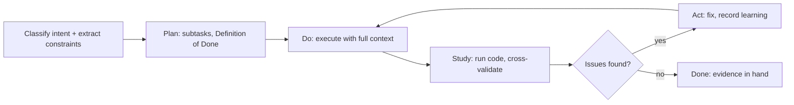
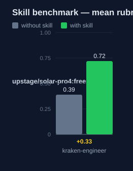

# kraken-engineer — Human Guide

This skill is a general engineering method. It makes the agent plan first,
test first, and prove work with evidence before it claims done.

## What this skill does

The skill runs work in four PDSA phases: Plan, Do, Study, Act. Before the
phases start, it classifies the intent of the task and extracts constraints:
functional, non-functional, boundary, and resource.

Plan defines subtasks, dependencies, and a Definition of Done. Do executes
with full context and parallel calls where safe. Study runs the code and the
tests — it does not only read them. Act fixes issues and records what was
learned. For specialist work, the skill points to a reference file per task
type: planning, architecture, codebase search, research, visual design,
documentation, and more.

The skill also sets hard constraints. No suppressed type errors. No commit
without a request. No claim of success without a run. No speculation about
code that was not read.

## Why use this skill

Use this skill for any non-trivial engineering task: implementation,
refactoring, bug fixes, planning, or architecture. Load it together with a
specialist skill. This skill governs the process. The specialist governs the
technique.

## When not to use

Do not use this skill for a question with a direct answer. Do not use it as a
replacement for a specialist skill — it is an overlay, not a capability. Do
not use its full process for a one-line change.

## How the skill works

## Measured impact

We ran a with/without benchmark. A clean base agent got the task. The base
agent has no skills and no tools. The same agent then got the task with this
skill's documentation. A deterministic rubric scored each answer. We ran each
arm three times.

| Arm | Score |
|---|---|
| Without skill | 0.39 |
| With skill | **0.72** (+0.33) |

Method: SkillsBench-style A/B. The model is upstage/solar-pro4:free. The rubric and the
runner stay internal. Any clean base agent with the same prompts can
reproduce these results.
