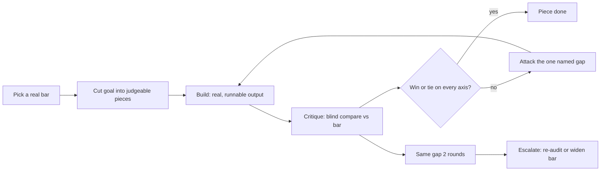
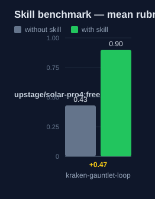

# kraken-gauntlet-loop: Human Guide

This skill runs a quality loop. The agent builds a piece, a separate critic
compares it against a real reference blind, and the builder attacks the one
gap the critic names. The loop stops only on a win or a tie.

## What this skill does

The skill picks a quality bar first: a real shipped product, a published
spec, or a benchmark. The goal is then cut into small pieces. Each piece can
be judged on its own. Each piece runs its own loop.

Each round has four steps. Build: make real, runnable output. Critique: a
separate agent compares the output against the bar, blind. Compare: the
verdict is win, tie, or lose per axis: "improved" does not count. Loop:
repeat until every axis wins or ties.

The kraken version adds two rules. The verdict needs two independent signals
before it is accepted. If the same gap stays for two rounds, the loop stops
and escalates: the bar is re-audited, widened, or the piece is split.

## Why use this skill

Use this skill when the target is quality against a real reference, not just
correctness. Use it when a shipped comparable exists, or a measurable bar can
be set. Use it with kraken-engineer when you also want planning and
evidence-gated completion around the loop.

## When not to use

Do not use this skill when the spec is fully known and a test can assert
correctness: use `kraken-blitzkrieg-tdd` alone. Do not use it when no real
bar exists. Do not use it when "good enough" is the goal. Use the standalone
`gauntlet-loop` when you want the loop without process overhead.

## How the skill works

## Measured impact

We ran a with/without benchmark. A clean base agent got the task. The base
agent has no skills and no tools. The same agent then got the task with this
skill's documentation. A deterministic rubric scored each answer. We ran each
arm three times.

| Arm | Score |
|---|---|
| Without skill | 0.43 |
| With skill | **0.90** (+0.48) |

Method: SkillsBench-style A/B. The model is upstage/solar-pro4:free. The rubric and the
runner stay internal. Any clean base agent with the same prompts can
reproduce these results.
