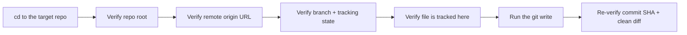
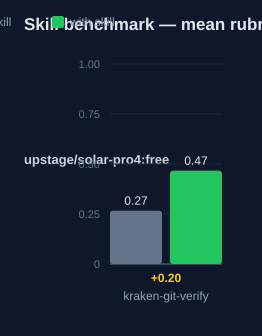

# kraken-git-verify — Human Guide

This skill prevents silent git failures. A command can look correct but land
on the wrong repo, branch, or remote. The skill makes you verify the chain
before and after every git write.

## What this skill does

The skill gives a short checklist to run before any git write. It confirms
the repo root with `git rev-parse --show-toplevel`. It confirms the remote
with `git config remote.origin.url`. It confirms the branch with
`git branch --show-current`. It confirms the repo tracks the file, with
`git ls-files --error-unmatch`. After the write, it re-verifies the
commit and the diff.

The skill targets work across nested or multiple repos. The terminal can sit
in repo A while file tools write to repo B. The commit then lands on the
wrong project. The skill treats any path mismatch as a hard stop. It also
gives a merge-status check to run before you delete a branch.

## Why use this skill

Use this skill whenever you clone or work in more than one repo in a session.
Use it before a commit, a push, a branch operation, or a checkout. Use it any
time you ask: did that command land where I think it did?

## When not to use

Do not use this skill for read-only git commands such as `git log` or
`git diff` alone. Do not use it when you work in one repo only and the state
is already known.

## How the skill works

## Measured impact

We ran a with/without benchmark. A clean base agent got the task. The base
agent has no skills and no tools. The same agent then got the task with this
skill's documentation. A deterministic rubric scored each answer. We ran each
arm three times.

| Arm | Score |
|---|---|
| Without skill | 0.27 |
| With skill | **0.47** (+0.20) |

Method: SkillsBench-style A/B. The model is upstage/solar-pro4:free. The rubric and the
runner stay internal. Any clean base agent with the same prompts can
reproduce these results.
