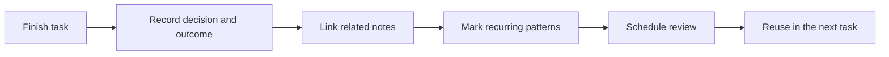
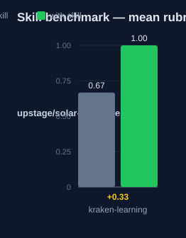

# kraken-learning: Human Guide

This skill saves what you learn after meaningful work. It turns one-off
lessons into knowledge you reuse. You do not need a database for it.

## What this skill does

The skill gives four practices to run after you finish a non-trivial task.
First, record the decision, its outcome, and any reusable pattern. Second,
link related decisions into a small graph. Third, record signals that recur
across tasks as patterns, each with a confidence level. Fourth, schedule a
review of high-value notes so they inform future work. Each practice takes a
moment. Together they stop you from re-learning the same lesson.

## Why use this skill

Use this skill after you finish a task that taught you something. Use it
when a decision worked or failed in a way that will repeat. Use it when the
same signal shows up in more than one task.

## When not to use

Do not use this skill during a task. It runs after the work is done. Do not
use it for trivial work that taught you nothing new.

## How the skill works

## Measured impact

We ran a with/without benchmark. A clean base agent got the task. The base
agent has no skills and no tools. The same agent then got the task with this
skill's documentation. A deterministic rubric scored each answer. We ran each
arm three times.

| Arm | Score |
|---|---|
| Without skill | 0.67 |
| With skill | **1.00** (+0.33) |

Method: SkillsBench-style A/B. The model is upstage/solar-pro4:free. The rubric and the
runner stay internal. Any clean base agent with the same prompts can
reproduce these results.
