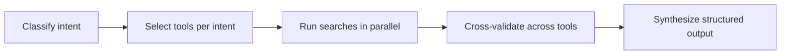
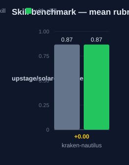

# kraken-nautilus — Human Guide

This skill guides codebase search. It picks the right tool for each
question, runs searches in parallel, and cross-validates the results. The
output is structured and complete.

## What this skill does

The skill classifies your search intent first. "Where is X defined" is a
structural question. "Who calls X" is a usage question. Each intent maps to
tools: LSP for definitions and references, ast_grep for structural patterns,
grep for text, glob for file names, git log and git blame for history. The
skill runs independent searches in parallel. It then cross-validates the
results across tool types. It reports ranked findings, supporting evidence,
a confidence level, and next steps. All paths in the output are absolute.

## Why use this skill

Use this skill for multi-module or multi-angle search. Use it when a fast
but incomplete answer costs more than a systematic one. Use it when you must
find all matches, not some matches.

## When not to use

Do not use this skill when you already know the answer and only need one
file. A direct read is faster. Do not use it for single-file questions with
no history or pattern angle.

## How the skill works

## Measured impact

We ran a with/without benchmark. A clean base agent got the task. The base
agent has no skills and no tools. The same agent then got the task with this
skill's documentation. A deterministic rubric scored each answer. We ran each
arm three times.

This skill did not raise the score on this task. The base model already answers this task well.

| Arm | Score |
|---|---|
| Without skill | 0.87 |
| With skill | **0.87** (+0.00) |

Method: SkillsBench-style A/B. The model is upstage/solar-pro4:free. The rubric and the
runner stay internal. Any clean base agent with the same prompts can
reproduce these results.
