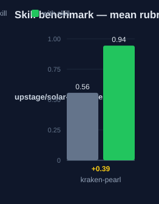

# kraken-pearl: Human Guide

This skill extracts structured information from media files. It works on
PDFs, images, diagrams, screenshots, presentations, and charts. It reports
only what the evidence shows.

## What this skill does

The skill classifies the media type first. Each type has an extraction
focus. PDFs give text, tables, and structure. Images give visual content and
in-image text. Diagrams give relationships and flows. Screenshots give UI
elements and layout. Charts give data points and trends. The skill then
fills one structured template: key findings, extracted data, metadata,
relevance, and recommendations. It does not add content that is not in the
file. It marks partial or unclear content as such, and it states a
confidence level.

## Why use this skill

Use this skill when you need a complete, parseable account of a media file.
Use it when invented content would cause harm. Two examples: data entry from
a scanned table, and UI review from a screenshot.

## When not to use

Do not use this skill for plain text files. A direct read is simpler. Do not
use it when you need judgment beyond what is visible. This skill describes
evidence. It does not speculate.

## How the skill works

## Measured impact

We ran a with/without benchmark. A clean base agent got the task. The base
agent has no skills and no tools. The same agent then got the task with this
skill's documentation. A deterministic rubric scored each answer. We ran each
arm three times.

| Arm | Score |
|---|---|
| Without skill | 0.56 |
| With skill | **0.94** (+0.39) |

Method: SkillsBench-style A/B. The model is upstage/solar-pro4:free. The rubric and the
runner stay internal. Any clean base agent with the same prompts can
reproduce these results.
