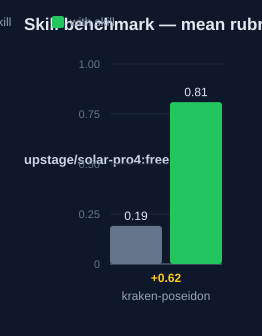

# kraken-poseidon — Human Guide

This skill analyzes a request before you plan it. It surfaces requirements,
boundaries, and hidden ambiguities. It outputs a structured specification
for the planner.

## What this skill does

The skill classifies the request intent first. The types are refactoring,
greenfield, enhancement, integration, and investigation. The intent sets the
whole strategy. The skill then extracts four constraint sets. Functional
constraints say what the solution must do. Non-functional constraints cover
performance, reliability, and security. Boundary constraints say what is out
of scope and what must not change. Resource constraints list dependencies
and patterns to follow. The skill then checks for vague terms, missing
context, and implicit assumptions. It ends with a structured specification:
intent, constraints, quality gates, an ambiguity report, and open questions.

## Why use this skill

Use this skill when a request is ambiguous, complex, or multi-faceted. Use
it before any planning step. Complete understanding at this stage prevents
scope creep and implementation surprises later.

## When not to use

Do not use this skill for a simple, clear task with one obvious step. Do
not use it after planning has started. It runs before the plan.

## How the skill works

## Measured impact

We ran a with/without benchmark. A clean base agent got the task. The base
agent has no skills and no tools. The same agent then got the task with this
skill's documentation. A deterministic rubric scored each answer. We ran each
arm three times.

| Arm | Score |
|---|---|
| Without skill | 0.19 |
| With skill | **0.81** (+0.62) |

Method: SkillsBench-style A/B. The model is upstage/solar-pro4:free. The rubric and the
runner stay internal. Any clean base agent with the same prompts can
reproduce these results.
