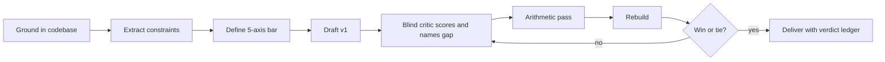
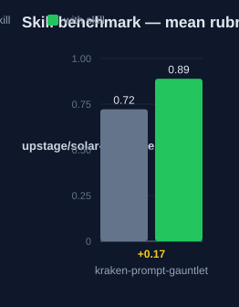

# kraken-prompt-gauntlet: Human Guide

This skill upgrades a raw brief into a build-grade prompt. It runs a
critic-rebuild loop until the prompt meets a fixed quality bar. The output
is a spec a builder can execute without asking questions.

## What this skill does

The skill first reads the real target codebase and extracts every constraint
from the brief. It then defines a five-axis bar: completeness, specificity,
executability, coherence, and low ambiguity. It drafts version 1 of the
prompt with a value for every constant. A blind critic then scores all five
axes and names the single biggest gap. The skill re-derives the arithmetic
itself before each rebuild: reachability, economy, and time. A fresh
confirmation critic must re-derive the same numbers and declare the verdict.
The loop stops only on a win or a tie. It never stops on a timer.

## Why use this skill

Use this skill when a brief will be handed to a builder agent. Use it when
vague constants or invented details would force rebuilds later. Use it for
specs where the numbers must close, such as game pacing or economy designs.

## When not to use

Do not use this skill for a prompt you will run yourself once and fix on the
fly. Do not use it for small edits to an existing spec. The loop costs time.
A direct edit is faster.

## How the skill works

## Measured impact

We ran a with/without benchmark. A clean base agent got the task. The base
agent has no skills and no tools. The same agent then got the task with this
skill's documentation. A deterministic rubric scored each answer. We ran each
arm three times.

| Arm | Score |
|---|---|
| Without skill | 0.72 |
| With skill | **0.89** (+0.17) |

Method: SkillsBench-style A/B. The model is upstage/solar-pro4:free. The rubric and the
runner stay internal. Any clean base agent with the same prompts can
reproduce these results.
