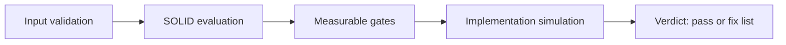
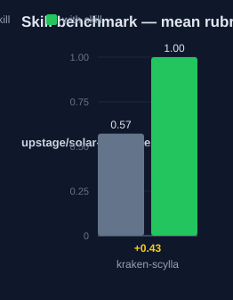

# kraken-scylla: Human Guide

This skill audits a work plan before you run it. It checks the plan against
SOLID principles and measurable quality gates.

## What this skill does

The skill takes one plan and runs four checks. It first makes sure the input
is one clear plan. It then scores the plan on SOLID principles. It then
measures the plan against six quality gates with set thresholds. It then
simulates the implementation to find problems before work starts. The result
is a verdict: pass, or fail with the list of what to fix.

## Why use this skill

Use this skill when a plan is ready and work has not started. It catches weak
tasks, vague terms, and missing tests before they cost time.

## When not to use

Do not use this skill to write a plan. Use `kraken-cartographer` for that. Do
not use it for code review after the work is done.

## How the skill works

## Measured impact

We ran a with/without benchmark. A clean base agent got the task. The base
agent has no skills and no tools. The same agent then got the task with this
skill's documentation. A deterministic rubric scored each answer. We ran each
arm three times.

| Arm | Score |
|---|---|
| Without skill | 0.57 |
| With skill | **1.00** (+0.43) |

Method: SkillsBench-style A/B. The model is upstage/solar-pro4:free. The rubric and the
runner stay internal. Any clean base agent with the same prompts can
reproduce these results.

## See also

- `kraken-cartographer`: writes the plan this skill audits.
- `kraken-engineer`: the wider engineering method.
