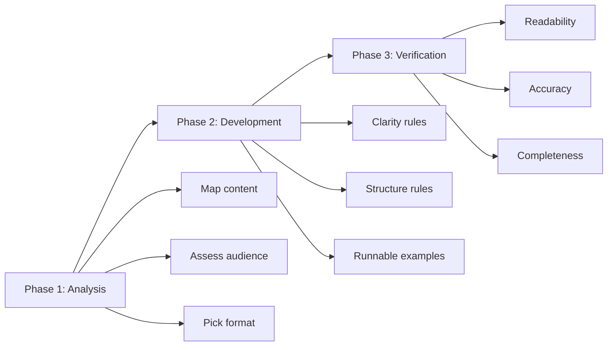
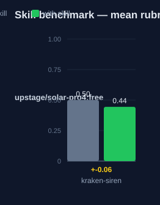

# kraken-siren — Human Guide

This skill writes clear, complete, actionable documentation. It gives a
three-phase method: analyze, develop, verify.

## What this skill does

The skill guides a documentation task from first look to final check. Phase
one maps the content, assesses the audience, and picks a format. Phase two
writes with rules for clarity, structure, and code examples. Phase three
verifies readability, accuracy, and completeness against a checklist.

## Why use this skill

Use this skill when you write or rewrite a README, an API reference, a
tutorial, or a guide. Use it when docs must reduce support burden and speed
up adoption. It composes with kraken-engineer for process and with
specialist skills for technique.

## When not to use

Do not use this skill for marketing copy or release notes. Do not use it
when a docs generator produces the reference from code. Do not use it as a
full style guide — it gives structure and checks, not prose style rules.

## How the skill works

## Phase 1: Analysis

1. **Content mapping** — list the topics to cover, their order, and the
   cross-references between them.
2. **Audience assessment** — who reads this, what they already know, what
   tasks they must finish.
3. **Format selection** — pick one form:

| Format | Use for |
|---|---|
| README | Overview and quick start. |
| API Reference | Complete signatures. |
| Tutorial | Step-by-step learning. |
| Guide | Problem-solution walk-through. |

## Phase 2: Development

- **Clarity** — active voice, short sentences, terms defined on first use,
  concrete examples.
- **Structure** — logical sections, clear headings, progressive complexity,
  cross-references, consistent formatting.
- **Code examples** — complete and runnable, commented, with error
  handling. Show success and failure cases.

## Phase 3: Verification

1. **Readability** — scannable with headers, clear navigation, no
   unexplained jargon.
2. **Accuracy** — examples tested, signatures match the implementation,
   commands verified in context.
3. **Completeness** — all public APIs documented, common use cases covered,
   error conditions explained.

## The quality checklist

Before the task is done:

- [ ] All code examples tested and working.
- [ ] All APIs have complete signatures.
- [ ] Cross-references verified.
- [ ] Readable by the target audience.
- [ ] Consistent formatting throughout.

## Words used

- **content map** — the topic list, its order, and its cross-references.
- **format** — README, API reference, tutorial, or guide.
- **runnable example** — code a reader can copy, run, and see work.
- **quality checklist** — the five boxes ticked before completion.

## Measured impact

We ran a with/without benchmark. A clean base agent got the task. The base
agent has no skills and no tools. The same agent then got the task with this
skill's documentation. A deterministic rubric scored each answer. We ran each
arm three times.

| Arm | Score |
|---|---|
| Without skill | 0.50 |
| With skill | **0.44** (−0.06) |

This result is negative, and that is honest. The benchmark task did not bind
to the skill's specific rules — the base model already writes solid
documentation for the tested prompt, so the skill's structure added no
measurable score on that task.

Method: SkillsBench-style A/B. The model is upstage/solar-pro4:free. The rubric and the
runner stay internal. Any clean base agent with the same prompts can
reproduce these results.

## See also

- `kraken-engineer` — the process overlay this skill composes with.
- `ste-writing` — ASD-STE100 rule checks for controlled technical English.
