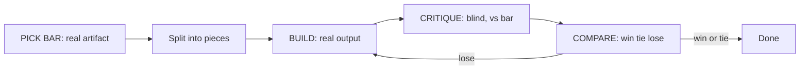
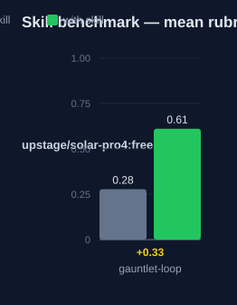

# gauntlet-loop — Human Guide

This skill runs a build-critic-rebuild loop. The loop drives an output toward
a real quality bar. It stops when the output wins or ties against that bar.

## What this skill does

The skill picks a bar first. The bar is a real, inspectable artifact. Then the
skill splits the goal into small pieces. Each piece gets a builder and a
separate critic. The critic compares the real output to the bar, blind. It
names one biggest gap. The builder fixes that gap. The loop repeats until the
output wins or ties on every axis.

The skill keeps a live progress page. The page records every verdict. No state
is hidden between rounds.

## Why use this skill

Use this skill when the task must get good, not just done. Use it when
"complete" is not enough and a real reference exists to judge against.

## When not to use

Do not use this skill for correctness against a known spec. Use TDD instead.
Do not use it when no real bar exists. Do not use it for standard tasks where
"good enough" is the goal. The loop overhead only pays off for quality
targets.

## How the skill works

## The bar

The bar is one concrete artifact. A critic can open it and judge it. Pick the
bar before round 1. Do not pick it after the first draft.

Good bars: a shipped product, a published spec, a benchmark leaderboard.

If no real artifact exists, use a measurable property instead: file size,
frame budget, error bound, or test pass rate. If you cannot name a bar at
all, the loop has nothing to converge on. Stop.

## The round protocol

1. **BUILD** — the builder makes real, runnable output. Not a plan. Not a
   summary. The actual artifact.
2. **CRITIQUE** — the critic opens the bar and the output side by side,
   blind. It names the single biggest gap. That gap becomes the next build
   prompt, word for word.
3. **COMPARE** — the critic gives a verdict per axis: win, tie, or lose.
   Tie counts as a win.
4. **LOOP** — repeat until every axis wins or ties.

## The verdicts

| Verdict | Meaning |
|---|---|
| win | The output beats the bar on the axis. |
| tie | The two are indistinguishable on the axis. |
| lose | The bar still wins. Name the biggest gap. |

## The critic

The critic is a separate agent with fresh context. It never sees the build
plan. It assumes the output still loses. It judges only the real output
against the real bar. It never compares two drafts of the agent's work to
each other. It names one gap per round, not a list.

## The lead agent

The lead agent picks the bar and the axes. It splits the goal into the
smallest judgeable pieces. It updates the progress page each round. It does
not set the architecture or a fixed round count.

## The progress page

One file, for example `gauntlet-progress.md`. One row per piece: piece, axis,
verdict, biggest gap, round. The page is the record of the run.

## Safety rails

- No fake bars. The bar must be a real artifact a fresh critic can open.
- No self-judgment. The builder never critiques its own work in the same
  round.
- One gap per round. No scope creep.
- Real outputs only. Mock summaries are not artifacts.
- The run stops only on a win or tie, or when you stop it. Not on a timer.

## Words used

- **bar** — the reference artifact the output is judged against.
- **axis** — one property the critic scores, such as speed or clarity.
- **critic** — the separate agent that judges output against the bar, blind.
- **verdict** — win, tie, or lose on one axis.
- **progress page** — the live file that records every round.

## Measured impact

We ran a with/without benchmark. A clean base agent got the task. The base
agent has no skills and no tools. The same agent then got the task with this
skill's documentation. A deterministic rubric scored each answer. We ran each
arm three times.

| Arm | Score |
|---|---|
| Without skill | 0.28 |
| With skill | **0.61** (+0.33) |

Method: SkillsBench-style A/B. The model is upstage/solar-pro4:free. The rubric and the
runner stay internal. Any clean base agent with the same prompts can
reproduce these results.

## See also

- `references/bar.md` — the bar template and the comparison sentence.
- `references/prompt.md` — the copy-pasteable agent prompt.
- `kraken-gauntlet-loop` — the Kraken version with PDSA and plan-audit gates.
