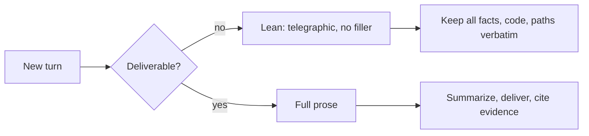
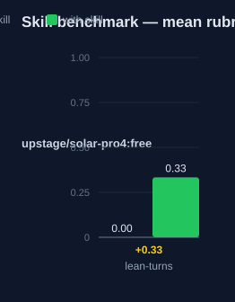

# lean-turns — Human Guide

This skill saves tokens on long, tool-heavy runs. It compresses the
intermediate turns — the play-by-play the user mostly does not read — and
reserves full prose for the final deliverable.

## What this skill does

The skill marks every turn before the closing deliverable as intermediate.
Intermediate turns get a lean, telegraphic style. The final turn gets normal
readable prose. Facts, code, paths, and errors are never compressed. Only
connective filler is cut.

## Why use this skill

Use this skill on multi-step runs with many tool calls. Use it under token
pressure, or when the context creeps toward its limit. Use it when the user
says "save tokens", "cut the play-by-play", or "just give me the summary".

## When not to use

Do not use this skill on a single-turn reply with no tool calls. That reply
is the deliverable. Do not use it when the user asks for a full trace or
"show every step". Do not use it when an audit mandates a complete record.

## How the skill works

## Intermediate turns

You cannot see the future, so decide per turn. If the work is not handed off
yet — still exploring, calling tools, verifying — the turn is intermediate.
Write it lean.

The lean style:

- Drop filler words: "I'll now", "Let me", "I'm going to".
- Drop articles where unambiguous: "the file `src/a.ts`" → "`src/a.ts`".
- Fragments are fine. Subject and verb can be implied.
- Symbols in prose only: `→` then, `&` and, `b/c` because, `w/` with.
- Common abbreviations: impl, config, refactor, deps, msg, ctx, param.
- Status prefixes, one per progress line: `P:` planning, `E:` executing,
  `V:` verifying, `F:` finalizing.
- Numbers exact: `3 files`, not `three files`.

## What is never compressed

- Code, identifiers, file paths, symbol names.
- Error messages, command output, diffs, JSON, log lines.
- Shell commands, URLs, version strings.
- Any load-bearing number, path, decision, or risk.
- A specialist skill's mandated output sections.
- A safety rule, warning, or hard constraint.

## The final turn

Write the closing turn in normal, readable prose. Summarize what was done.
Deliver the result. Cite verification evidence. Note decisions and risks. No
symbol shorthand, no telegraphic dialect.

Written artifacts count as deliverables: PR descriptions, commit messages,
doc files, and release notes are full prose, never compressed.

## Precedence rules

- Hard constraints of any active skill win over compression.
- A skill that mandates a visible section keeps that section — its content
  goes lean, the section does not disappear.
- A skill that demands a full reasoning trace wins for the traced sections.
- The user's own messages are never rewritten.

## Words used

- **intermediate turn** — any turn before the deliverable.
- **final turn** — the deliverable turn, full prose.
- **lean** — telegraphic style, fewer connective words, same structure.
- **filler** — words that carry no information.

## Measured impact

We ran a with/without benchmark. A clean base agent got the task. The base
agent has no skills and no tools. The same agent then got the task with this
skill's documentation. A deterministic rubric scored each answer. We ran each
arm three times.

| Arm | Score |
|---|---|
| Without skill | 0.00 |
| With skill | **0.33** (+0.33) |

Method: SkillsBench-style A/B. The model is upstage/solar-pro4:free. The rubric and the
runner stay internal. Any clean base agent with the same prompts can
reproduce these results.

## See also

- `lean-turns-strict` — the stricter sibling: one status token per
  intermediate turn.
