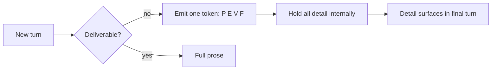
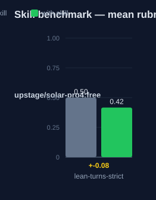

# lean-turns-strict — Human Guide

This skill is the strict variant of lean-turns. The user sees exactly one
status token per intermediate turn. All other content waits for the final
deliverable turn.

## What this skill does

The skill collapses every intermediate turn to a single status token. The
agent still reasons, explores, calls tools, and verifies as normal. Strict
mode changes what is visible, not what the agent understands. All detail —
paths, errors, decisions, risks, findings — is held internally and surfaced
in the final turn.

## Why use this skill

Use this skill when the user says "strict mode", "ultra lean", "one token
per turn", "suppress the play-by-play", or "I only want the final answer".
Use it on long tool-heavy runs where the user will not read progress.

## When not to use

Do not use this skill on a single-turn reply with no tool calls. That reply
is the deliverable. Do not use it when the user asks for a full trace or
"show every step". Do not use it when an active skill hard-mandates
immediate disclosure, such as a security stop or an audit trace.

## How the skill works

## The four tokens

| Token | Meaning |
|---|---|
| `P:` | planning |
| `E:` | executing |
| `V:` | verifying |
| `F:` | finalizing |

One token per turn. No prose, no symbols, no abbreviations. Pick the token
that matches the current step.

## The final turn

The final turn is full, readable prose. It surfaces everything deferred
during the run: what was done, the result, verification evidence, decisions,
and risks. Paths, errors, and identifiers appear verbatim. Written artifacts
— PR descriptions, commit messages, docs — are full prose, never compressed.

## What strict mode never does

- It never reduces the agent's own reasoning or verification.
- It never drops a load-bearing fact, path, decision, or risk.
- It never hides an error that a mandate requires disclosing.
- It never breaks a specialist skill's mandated output format.
- It never rewrites the user's messages.

## Precedence rules

- Hard constraints of any active skill win. A skill that mandates a visible
  section mid-run keeps that section.
- Composes with lean-turns: enable both, strict governs the turns. Strict's
  "defer to final" rule overrides lean-turns' "surface verbatim" rule for
  the agent's own narration.
- Safety outranks suppression: a hard mandate to disclose forces a full
  turn.

## Words used

- **status token** — one of `P:`, `E:`, `V:`, `F:`. The only visible
  content of an intermediate turn.
- **deferred disclosure** — detail held internally and emitted in the final
  turn, verbatim where required.
- **suppression** — collapsing visible output, not understanding.

## Measured impact

We ran a with/without benchmark. A clean base agent got the task. The base
agent has no skills and no tools. The same agent then got the task with this
skill's documentation. A deterministic rubric scored each answer. We ran each
arm three times.

| Arm | Score |
|---|---|
| Without skill | 0.50 |
| With skill | **0.42** (−0.08) |

This result is negative, and that is honest. The benchmark task did not bind
to the skill's specific rules — the rubric rewarded detail the strict mode
defers by design, so the with-skill arm scored lower on that task. The
token saving is the point of the skill; the rubric did not measure it.

Method: SkillsBench-style A/B. The model is upstage/solar-pro4:free. The rubric and the
runner stay internal. Any clean base agent with the same prompts can
reproduce these results.

## See also

- `lean-turns` — the base skill: lean intermediate turns, full final turn.
