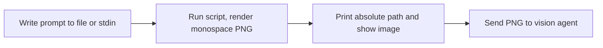
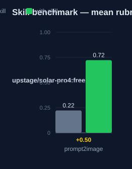

# prompt2image: Human Guide

This skill renders a text prompt as a compact monospace PNG image. A
vision-capable agent reads the image for fewer tokens than the raw text.

## What this skill does

The skill runs one script, `scripts/prompt2image.py`. You give it text from a
file or from stdin. The script renders the text as a monospace PNG with Pillow.
You can set the width and the font size with flags. The skill then tells you to
print the absolute output path and to show the image to the user. Do not stop
after you print the path.

## Why use this skill

Use this skill when the user says "prompt to image" or "turn this prompt into
an image". Use it when the user wants to send a long prompt to a vision model
without paying full text-token cost. The receiving side needs no QR decoder.
It only needs vision and OCR.

## When not to use

Do not use this skill when the text must arrive byte for byte. OCR is not
lossless. Use `prompt2qr` for exact transfer. Do not use it when the receiving
model has no vision. Do not use it for very long prompts when your provider
caps image dimensions.

## How the skill works

## Measured impact

We ran a with/without benchmark. A clean base agent got the task. The base
agent has no skills and no tools. The same agent then got the task with this
skill's documentation. A deterministic rubric scored each answer. We ran each
arm three times.

| Arm | Score |
|---|---|
| Without skill | 0.22 |
| With skill | **0.72** (+0.50) |

Method: SkillsBench-style A/B. The model is upstage/solar-pro4:free. The rubric and the
runner stay internal. Any clean base agent with the same prompts can
reproduce these results.
