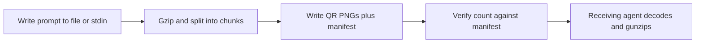
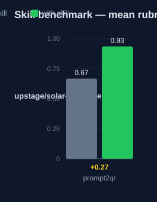

# prompt2qr: Human Guide

This skill compresses a prompt with gzip and encodes it as a sequence of
binary QR PNG images. The decode is lossless. The receiver gets the exact
original text back.

## What this skill does

The skill runs one script, `scripts/prompt2qr.py`. You give it text from a
file or from stdin. The script gzips the text, splits it into chunks, and
writes one QR PNG per chunk. It also writes a manifest with the total count.
The skill then tells you to print the output directory and to show each QR
image to the user. The receiving agent decodes the images with pyzbar or
zbarimg, then gunzips the data. The decode steps are in
`references/decoding.md`.

## Why use this skill

Use this skill when the user says "prompt to QR" or "encode this prompt as
QR". Use it when the text must arrive byte for byte. The QR images cost zero
text tokens on the sending side. Compare this with the raw text-token count
for long prompts.

## When not to use

Do not use this skill when the receiving agent has no QR decoder. Use
`prompt2image` instead when OCR-level accuracy is enough. Do not use it when
the data needs more than 255 QR codes. That is the hard limit of the format.

## How the skill works

## Measured impact

We ran a with/without benchmark. A clean base agent got the task. The base
agent has no skills and no tools. The same agent then got the task with this
skill's documentation. A deterministic rubric scored each answer. We ran each
arm three times.

| Arm | Score |
|---|---|
| Without skill | 0.67 |
| With skill | **0.93** (+0.27) |

Method: SkillsBench-style A/B. The model is upstage/solar-pro4:free. The rubric and the
runner stay internal. Any clean base agent with the same prompts can
reproduce these results.
