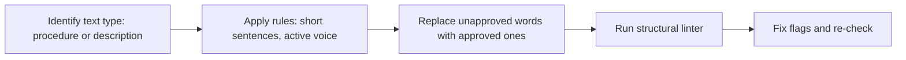
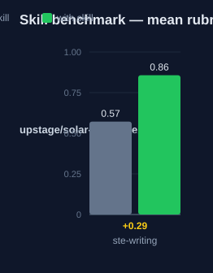

# ste-writing — Human Guide

This skill rewrites and checks technical text against the ASD-STE100 rules.
It ships the rule set and a stdlib-only structural linter. It does not ship
the copyrighted word dictionary.

## What this skill does

The skill guides a rewrite of procedures, descriptions, warnings, and
instructions. You mark each block as a procedure or a description. You apply
the rules: one instruction per sentence, active voice, approved verb forms
only, multi-word nouns of at most three words, and sentence limits of 20
words for procedures and 25 words for descriptions. A linter script,
`scripts/ste_check.py`, flags length, voice, -ing, and noun-string issues.
The linter is advisory only. It cannot check dictionary compliance.

## Why use this skill

Use this skill when the user says "write this in STE" or "check this against
STE rules". Use it for technical documentation with non-native English
readers. Use it for aircraft and maintenance instructions that must read
without ambiguity.

## When not to use

Do not use this skill for marketing copy or general prose. Do not use it as a
full grammar guide. The skill has no approved-word dictionary. Get the free
official spec from asd-ste100.org for dictionary lookups. No tool in this
skill auto-converts text or guarantees compliance.

## How the skill works

## Measured impact

We ran a with/without benchmark. A clean base agent got the task. The base
agent has no skills and no tools. The same agent then got the task with this
skill's documentation. A deterministic rubric scored each answer. We ran each
arm three times.

| Arm | Score |
|---|---|
| Without skill | 0.57 |
| With skill | **0.86** (+0.29) |

Method: SkillsBench-style A/B. The model is upstage/solar-pro4:free. The rubric and the
runner stay internal. Any clean base agent with the same prompts can
reproduce these results.
