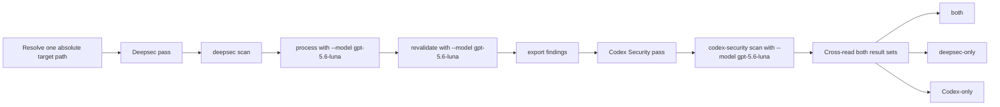
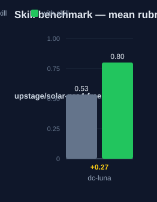

# deepsec-codex-luna — Human Guide

This skill runs two security scanners on one target. Both scanners use the Luna model. The results are merged into one summary.

## What this skill does

The skill runs deepsec and Codex Security on the same target. It fixes one absolute target path first. Then it runs the deepsec pass: `scan`, `process --model gpt-5.6-luna`, `revalidate --model gpt-5.6-luna`, and export to `./findings`. Skip `revalidate` only when the user asks for a faster pass. Then it runs the Codex Security pass with `npx @openai/codex-security scan` and `--model gpt-5.6-luna`. When a deepsec `data/<id>/INFO.md` file exists, the skill passes it as scan context with `--knowledge-base`. The last step compares both result sets. Each issue goes into one of three buckets: both, deepsec-only, or Codex-only. Empty buckets are named as empty.

## Why use this skill

Use this skill when you combine deepsec with the open-source Codex Security CLI or plugin. Use it when the user asks for a Luna dual security scan, or wants both scanners on one codebase. Two scanners find more issues than one. The cross-read shows which issues both tools confirm. It also shows what each tool alone finds.

## When not to use

Do not use this skill when one scanner is enough. Do not use it when the user asks for deepsec only; use deepsec-luna instead. Do not use it for tests that need other tools, such as live application tests. The skill needs Codex Security auth: `npx @openai/codex-security login`, or an `OPENAI_API_KEY` or `CODEX_API_KEY` variable. Without auth, the Codex pass fails.

## How the skill works

## Measured impact

We ran a with/without benchmark. A clean base agent got the task. The base
agent has no skills and no tools. The same agent then got the task with this
skill's documentation. A deterministic rubric scored each answer. We ran each
arm three times.

| Arm | Score |
|---|---|
| Without skill | 0.53 |
| With skill | **0.80** (+0.27) |

Method: SkillsBench-style A/B. The model is upstage/solar-pro4:free. The rubric and the
runner stay internal. Any clean base agent with the same prompts can
reproduce these results.
