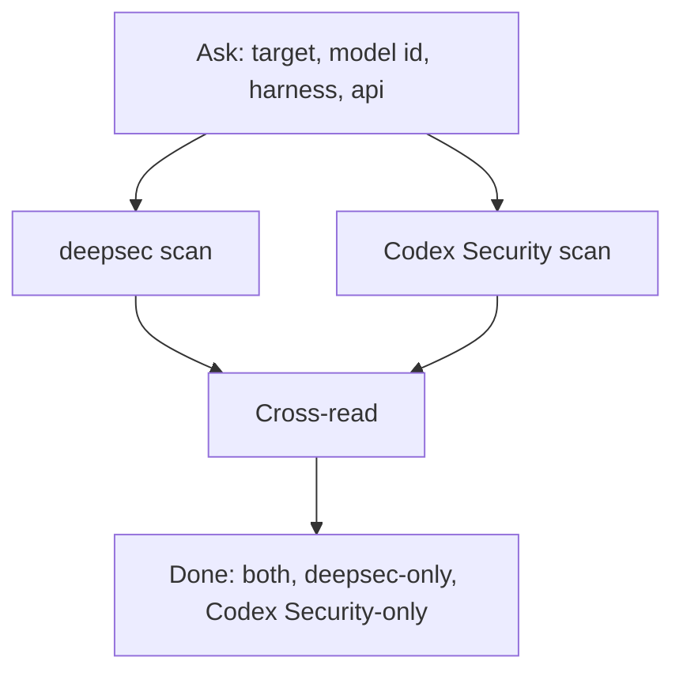
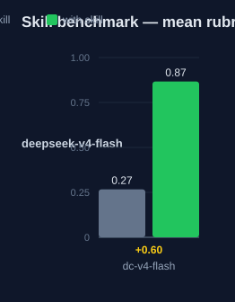

# deepsec-codex-v4-flash — Human Guide

This skill runs two security scanners on one codebase. The scanners are
deepsec and Codex Security. Both scans use the DeepSeek V4 Flash model. The
skill does not set the harness or the API. You set these values first.

## What this skill does

The skill runs the deepsec scanner. Then it runs the Codex Security scanner.
Then it compares the two result sets.

The skill asks you for these values first: the target path, the model id, and
the deepsec harness. It also asks for the deepsec API and the Codex Security
provider and API. The skill gives the correct commands. It never picks these
values for you.

## Why use this skill

Use this skill when you want two independent views of one codebase. The two
scanners find different issues. The cross-read joins their results.

## When not to use

Do not use this skill for one scanner only. Use `deepsec-v4-flash` for that.
Do not use it for the full auto-apply loop. Use `deepsec-orchestrator` for that.

## How the skill works



## Before you start

You need these tools:

| Tool | Purpose |
|---|---|
| deepsec | The first scanner. It runs from a `.deepsec/` workspace. |
| `@openai/codex-security` | The second scanner. Run it with `npx`. |
| pnpm | Runs deepsec. |
| Node.js 22+ | Runs both tools. |

Make a deepsec workspace first:

```bash
npx deepsec init
cd .deepsec
pnpm install
```

Keep your API keys in environment variables. Do not put keys in a file.

## The deepsec harness and API

DeepSeek is not a built-in deepsec backend. You reach it in two ways.

### Harness = pi

```bash
pnpm deepsec process --project-id <id> \
  --agent pi --model "<model-id>" \
  --ai-provider openai \
  --ai-base-url "<base-url>" \
  --ai-api-key-env <KEY_ENV>
```

### Harness = codex

```bash
OPENAI_BASE_URL="<base-url>" OPENAI_API_KEY="$<KEY_ENV>" \
  pnpm deepsec process --project-id <id> --agent codex --model "<model-id>"
```

## The Codex Security provider and API

Codex Security has two paths to DeepSeek.

### Provider = openrouter

OpenRouter hosts DeepSeek models. Set its key and pass the provider:

```bash
OPENROUTER_API_KEY="$<KEY_ENV>" \
npx @openai/codex-security scan "$TARGET" \
  --provider openrouter --model "<model-id>" \
  --output-dir "$OUT/codex-security-results"
```

### Custom endpoint

Use a custom OpenAI-compatible endpoint with a `--codex` override:

```bash
npx @openai/codex-security scan "$TARGET" \
  --codex 'model_providers.deepseek={name="deepseek",base_url="<base-url>",env_key="<KEY_ENV>"}' \
  --model "<model-id>" \
  --output-dir "$OUT/codex-security-results"
```

Check the exact `model_providers` shape on your Codex Security version. The
built-in providers are `openai`, `openrouter`, `fireworks`, and `amazon-bedrock`.

## Step by step

1. Ask the user for all the values.
2. Run the deepsec scan, process, revalidate, and export.
3. Run the Codex Security scan.
4. Cross-read the two result sets.
5. Put each issue in one of three buckets.

## The three buckets

| Bucket | Meaning |
|---|---|
| both | Both scanners found the issue. |
| deepsec-only | Only deepsec found it. |
| Codex Security-only | Only Codex Security found it. |

Name the empty buckets too. An empty bucket is a result.

## Measured impact

We ran a with/without benchmark. A clean base agent got the task. The base
agent has no skills and only base tools. The same agent then got the task
with this skill's documentation. A deterministic rubric scored each answer.
The rubric checks correct commands, the ask-first protocol, and the safety
rails. We ran each arm three times.

| Arm | Score |
|---|---|
| Without skill | 0.27 |
| With skill | **0.87** (+0.60) |



Method: SkillsBench-style A/B. A deterministic rubric scores each answer.
n=3 per arm. The base agent is a clean profile. The rubric and the runner
stay internal. Any clean base agent with the same prompts can reproduce
these results.

## See also

- `deepsec-codex-v4-pro` — the same skill with the Pro model.
- `deepsec-v4-flash` — the deepsec-only scan.
- `deepsec-orchestrator` — runs both scanners in a loop and applies fixes.
