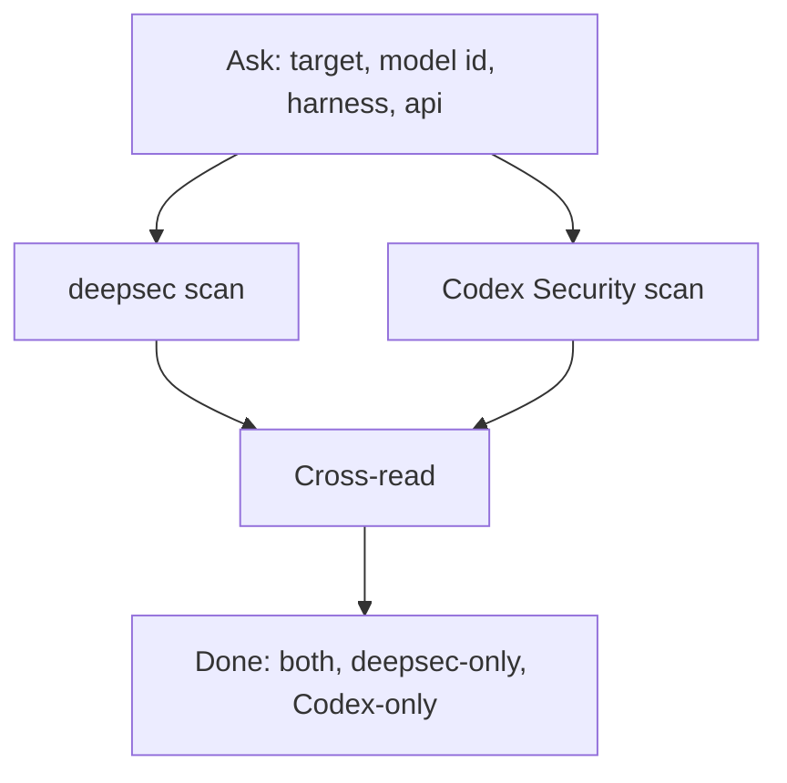

# DeepSec + Codex Security: DeepSeek V4 Pro

Run **both** scanners on the same target, both on **DeepSeek V4 Pro**. The
harness and API are **never hardcoded**: ask the user first, separately for
each tool.

## When to Use

- Dual-scan with deepsec and Codex Security on DeepSeek V4 Pro.
- The user wants both scanners on a v4-pro endpoint, or a combined pro scan.



> **For humans:** read `human.md` for a full guide with diagrams.

## 1. Ask the user (MANDATORY)

Collect, in this shape:

1. **target**: one absolute path, fixed for the whole run.
2. **model id**: exact DeepSeek V4 Pro identifier for their endpoint.
3. **deepsec harness**: `pi` or `codex`.
4. **deepsec api**: base URL + key env var name.
5. **Codex Security provider + api**: how Codex Security reaches DeepSeek:
   - `openrouter` (hosts DeepSeek models) → `OPENROUTER_API_KEY` + a
     `deepseek/...` model id, or
   - a custom OpenAI-compatible endpoint via `--codex` override → base URL +
     key env var name.

Missing any → ask again. Never assume a base URL, key env, provider, or model id.

## 2. DeepSec pass

From `.deepsec/` (where `deepsec.config.ts` and `pnpm` live):

```bash
pnpm deepsec scan
```

- `pi` harness:
  ```bash
  pnpm deepsec process --project-id <id> --agent pi --model "<model-id>" \
    --ai-provider openai --ai-base-url "<base-url>" --ai-api-key-env <KEY_ENV>
  pnpm deepsec revalidate --project-id <id> --agent pi --model "<model-id>" \
    --ai-provider openai --ai-base-url "<base-url>" --ai-api-key-env <KEY_ENV>
  ```
- `codex` harness: export `OPENAI_BASE_URL` / `OPENAI_API_KEY`, then
  `--agent codex` with the same `--model "<model-id>"` (drop the `--ai-*` flags).

Skip `revalidate` only if the user asks for a faster pass.

```bash
pnpm deepsec export --format md-dir --out ./findings
```

## 3. Codex Security pass

```bash
# OpenRouter path (hosts DeepSeek):
OPENROUTER_API_KEY="$<KEY_ENV>" \
npx @openai/codex-security scan "$TARGET" \
  --provider openrouter --model "<model-id>" \
  --output-dir "$OUT/codex-security-results"

# Custom OpenAI-compatible endpoint path (DeepSeek API / private gateway):
npx @openai/codex-security scan "$TARGET" \
  --codex 'model_providers.deepseek={name="deepseek",base_url="<base-url>",env_key="<KEY_ENV>"}' \
  --model "<model-id>" \
  --output-dir "$OUT/codex-security-results"
```

> The `--codex` custom-provider key shape is deep-merged TOML; confirm the
> exact `model_providers.*` schema on the user's `@openai/codex-security`
> version before relying on it (the built-in first-class providers are
> `openai`, `openrouter`, `fireworks`, `amazon-bedrock`).

When deepsec `data/<id>/INFO.md` exists, pass it as scan context:
`--knowledge-base "$DEEPSEC/data/<id>/INFO.md"`.

## 4. Cross-read

Compare deepsec export vs Codex Security `findings.json` / `report.md`. Bucket
every issue as **both**, **deepsec-only**, or **Codex-only**.

## Done when

- `./findings` exists AND `$OUT/codex-security-results/report.md` exists.
- The summary lists all three buckets (empty buckets named as empty).
- No command hardcoded the harness/api; the user's values were used everywhere.
