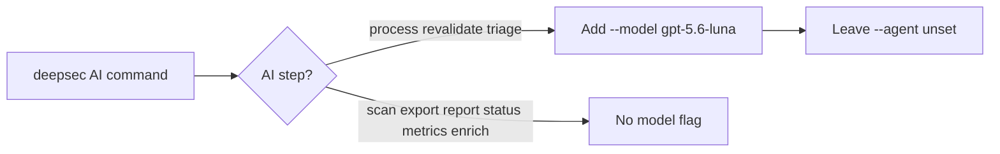
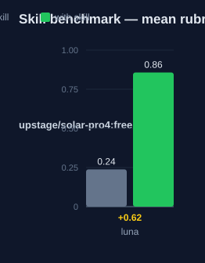

# deepsec-luna: Human Guide

This skill runs the deepsec security scanner with every AI step pinned to
the Luna model.

## What this skill does

The skill adds one flag to deepsec AI commands: `--model gpt-5.6-luna`. This
applies to `process`, `revalidate`, and `triage`, including under `sandbox`.
The skill leaves `--agent` unset so deepsec keeps its default backend.

Non-AI commands: `scan`, `export`, `report`, `status`, `metrics`, `enrich`:
need no model flags.

## Why use this skill

Use this skill when you want all deepsec AI work on Luna. Use it when the
user mentions Luna, 5.6-luna, or gpt-5.6-luna for a scan.

## When not to use

Do not use this skill for a dual scan with Codex Security. Use
`deepsec-codex-luna` for that. Do not use it for DeepSeek V4 model scans.
Use `deepsec-v4-flash` or `deepsec-v4-pro` for those.

## How the skill works



## Step by step

1. Run the scan to find candidate sites. No model flag needed.
2. Run `process`, `revalidate`, and `triage` with `--model gpt-5.6-luna`.
3. Export the findings. No model flag needed.

```bash
pnpm deepsec scan
pnpm deepsec process --model gpt-5.6-luna
pnpm deepsec revalidate --model gpt-5.6-luna
pnpm deepsec triage --model gpt-5.6-luna
pnpm deepsec export --format md-dir --out ./findings
```

## Command reference

| Command | Purpose | Needs the Luna flag? |
|---|---|---|
| `deepsec scan` | Find candidate sites. | No |
| `deepsec process` | Investigate candidates. | Yes |
| `deepsec revalidate` | Re-check findings. | Yes |
| `deepsec triage` | Rank findings. | Yes |
| `deepsec export` | Write findings to files. | No |
| `deepsec report` | Summarize the run. | No |
| `deepsec status` | Show workspace status. | No |
| `deepsec metrics` | Show run metrics. | No |
| `deepsec enrich` | Add metadata. | No |

## Done when

Every AI deepsec command in the turn includes `--model gpt-5.6-luna` and no
`--agent` override.

## Words used

- **Luna**: the model `gpt-5.6-luna`.
- **pin**: always pass the model flag on AI commands.
- **AI command**: `process`, `revalidate`, `triage` (including under
  `sandbox`).

## Measured impact

We ran a with/without benchmark. A clean base agent got the task. The base
agent has no skills and no tools. The same agent then got the task with this
skill's documentation. A deterministic rubric scored each answer. We ran each
arm three times.

| Arm | Score |
|---|---|
| Without skill | 0.24 |
| With skill | **0.86** (+0.62) |



Method: SkillsBench-style A/B. The model is upstage/solar-pro4:free. The rubric and the
runner stay internal. Any clean base agent with the same prompts can
reproduce these results.

## See also

- `deepsec-codex-luna`: adds the Codex Security scanner, also on Luna.
- `deepsec-v4-flash` and `deepsec-v4-pro`: DeepSeek V4 model scans.
- `deepsec-orchestrator`: runs both scanners in a loop with a judge.
