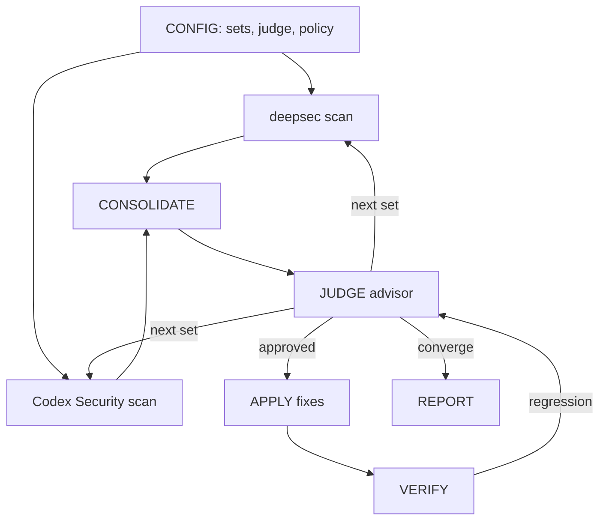
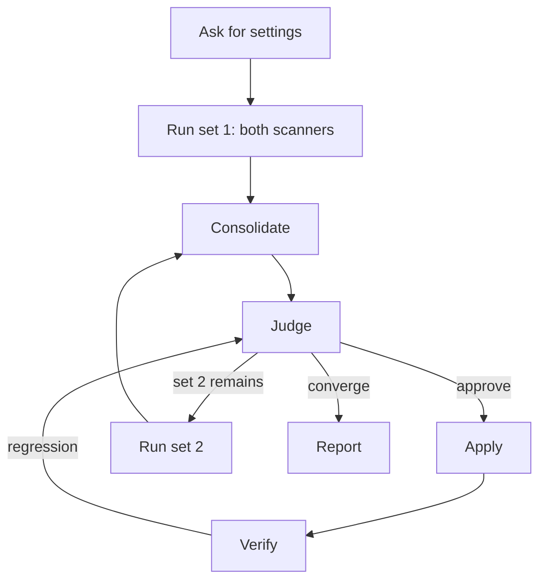

# deepsec-orchestrator — Human Guide

This skill runs deepsec and Codex Security side by side. It joins their
findings. Then an advisor agent judges the findings. The skill applies the
approved fixes. Then it loops with a new model, harness, or API set.

## What this skill does

The skill automates a full security workflow. The workflow has seven nodes.
The nodes form a chain. The chain loops back. This makes a graph.

The skill asks you for all settings first. It never picks a model, a harness,
or an API for you.

## Why use this skill

Use this skill for advanced security work. Use it when you want to try many
models in one run. Use it when you want the fixes applied for you.

## When not to use

Do not use this skill for one manual scan. Use a scanner skill for that. Do
not use it when you want a report with no fixes. Set the apply policy to
manual instead.

## The graph

### The nodes

| Node | Who runs it | Input | Output |
|---|---|---|---|
| SCAN·deepsec | a subagent | target + set | findings |
| SCAN·codex-security | a subagent, in parallel | target + set | results |
| CONSOLIDATE | the orchestrator | both outputs | one list |
| JUDGE | a subagent, fresh context | the list | verdicts |
| APPLY | a subagent | approved findings | commits |
| VERIFY | the orchestrator | the diffs | test results |
| REPORT | the orchestrator | everything | the final report |

### The edges

1. Both scanners send their output to CONSOLIDATE.
2. CONSOLIDATE sends one list to JUDGE.
3. JUDGE sends approved findings to APPLY.
4. APPLY sends diffs to VERIFY.
5. VERIFY sends regressions back to JUDGE.
6. JUDGE sends the next set back to the scanners.
7. JUDGE sends the final result to REPORT.

## The judge

The judge is an advisor agent. It has a fresh context. It never scans. It
only reads and decides.

The judge does these tasks:

- It removes duplicate findings across tools and sets.
- It ranks each finding by severity.
- It marks each finding safe-to-apply or not.
- It gives one pass verdict.

The pass verdict has three values:

| Verdict | Meaning |
|---|---|
| converge | Stop. No new serious finding appeared. |
| continue | Run the next set or re-scan. |
| escalate | Stop. A human must decide. |

## The settings

Before the run, the user gives these settings:

- **target** — one path.
- **sets** — a list of scanner settings. Each set has a model, a harness, and
  an API. You may run many sets in one run.
- **judge config** — the judge's own model and harness.
- **apply policy** — `auto`, `hybrid`, or `manual`.
- **stop criteria** — the loop limit and the convergence rule.

## The apply policy

| Policy | Behavior |
|---|---|
| auto | Apply every approved fix. |
| hybrid | Apply low-risk fixes. Prompt for high-risk fixes. |
| manual | Report only. Do not apply. |

## Safety rails

The skill applies fixes on a git branch. It never commits to `main`. It makes
one commit per finding. Every change is a revertable diff. It keeps a map of
finding to commit. It never commits secrets or `.env` files.

## The loop rules

The loop continues while a set remains or a fix causes a regression. The loop
limit caps the number of runs.

The loop stops on these events:

- The verdict is `converge`.
- You reach the loop limit.
- You stop it.
- The judge gives `escalate` twice for the same finding.

## Fine control

You control these knobs:

- The model, harness, and API for each set.
- The per-set scope: deepsec only, Codex Security only, or both.
- The judge model and harness.
- The apply policy.
- The deepsec thinking level and re-scan waves.
- The loop limit.

## The full workflow

## Progress file

The skill writes a progress file after each pass. The file is
`deepsec-orchestrator-progress.md`. It lists each set, tool, finding count,
verdict, and round.

## See also

- `references/judge-prompt.md` — the advisor prompt template.
- `references/graph.md` — the full node and edge reference.
- `deepsec-v4-flash` and `deepsec-v4-pro` — the single scanners.
- `deepsec-codex-v4-flash` and `deepsec-codex-v4-pro` — the dual scanners.
