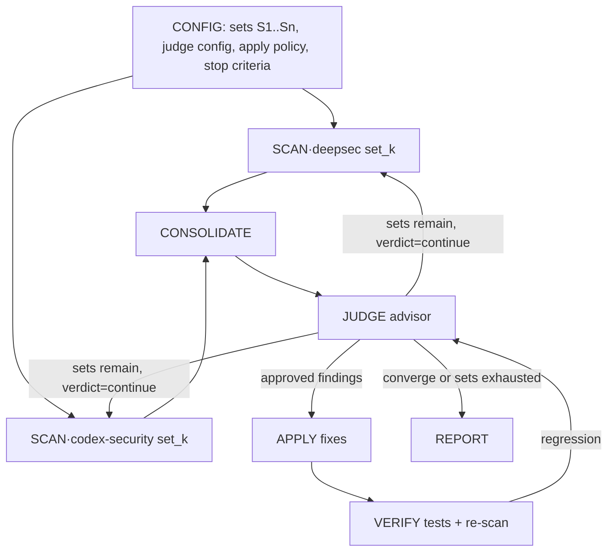

# Graph reference

The chain-shaped looping graph behind `deepsec-orchestrator`.

## Nodes

| Node | Runs as | Input | Output |
|---|---|---|---|
| SCAN·deepsec | subagent (leaf) | target + set_k | `findings` (md-dir export) |
| SCAN·codex-security | subagent (leaf), parallel | target + set_k | `codex-security-results/` |
| CONSOLIDATE | orchestrator | both scanner outputs | normalized `findings.jsonl` |
| JUDGE | subagent (leaf, fresh context) | consolidated list + judge config | per-finding verdict + pass verdict |
| APPLY | subagent (leaf, coding agent) | judge-approved findings | branch commits + finding→commit map |
| VERIFY | orchestrator | applied diffs | test re-runs + re-scan of changed files |
| REPORT | orchestrator | everything | final report + applied diff + per-set table |

## Edges

1. `SCAN·deepsec` + `SCAN·codex-security` → `CONSOLIDATE` (parallel fan-in)
2. `CONSOLIDATE` → `JUDGE`
3. `JUDGE` → `APPLY` (approved) and → next-set edge
4. `APPLY` → `VERIFY` → `JUDGE` (re-judge after fixes; regression → re-scan same set)
5. `JUDGE` → `SCAN` with `set_{k+1}` (sets remain, verdict ≠ converge)
6. `JUDGE` → `REPORT` (all sets exhausted or converge)

## Loop / stop conditions

- **Continue:** un-run set remains, or VERIFY reported a regression, and `max_loops` not hit.
- **Stalemate:** judge `escalate` repeats on the same finding across two passes → stop, hand to human.
- **Stop:** `converge` · `max_loops` reached · explicit user stop · stalemate escalation.

## Mermaid

