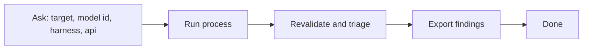
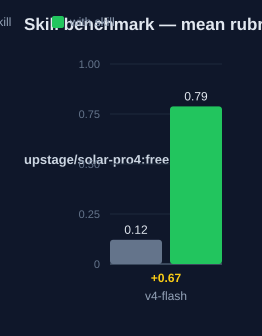

# deepsec-v4-flash — Human Guide

This skill runs the deepsec security scanner. The scan uses the DeepSeek V4
Flash model. The skill does not set the harness or the API. You set these two
values before the scan.

## What this skill does

The skill gives the deepsec commands for one security scan of one codebase.
The scan uses the DeepSeek V4 Flash model.

The skill asks you for four values first: the target path, the model id, the
harness, and the API. Then the skill gives the correct commands. It never picks
these values for you.

## Why use this skill

Use this skill when you want a fast, low-cost security scan. Use it when your
DeepSeek V4 Flash endpoint is ready.

## When not to use

Do not use this skill for a scan with Codex Security. Use
`deepsec-codex-v4-flash` for that. Do not use it for the Pro model. Use
`deepsec-v4-pro` for that.

## How the skill works



## Before you start

You need these tools:

| Tool | Purpose |
|---|---|
| deepsec | The scanner. It runs from a `.deepsec/` workspace. |
| pnpm | Runs deepsec. |
| Node.js | Runs pnpm. |

Make a deepsec workspace first:

```bash
npx deepsec init
cd .deepsec
pnpm install
```

Keep your DeepSeek key in an environment variable. Do not put the key in a file.

## The harness and the API

DeepSeek is not a built-in deepsec backend. You reach it in two ways.

### Harness = pi

The `pi` harness uses a generic provider. You pass the base URL and the key:

```bash
pnpm deepsec process --project-id <id> \
  --agent pi --model "<model-id>" \
  --ai-provider openai \
  --ai-base-url "<base-url>" \
  --ai-api-key-env <KEY_ENV>
```

### Harness = codex

The `codex` harness reads two environment variables:

```bash
OPENAI_BASE_URL="<base-url>" OPENAI_API_KEY="$<KEY_ENV>" \
  pnpm deepsec process --project-id <id> --agent codex --model "<model-id>"
```

## Step by step

1. Ask the user for the four values.
2. Run the scan. Use the command that matches the harness.
3. Revalidate. Use the same harness and model.
4. Triage. Use the same model.
5. Export the findings.

```bash
pnpm deepsec revalidate --project-id <id> --agent pi --model "<model-id>" \
  --ai-provider openai --ai-base-url "<base-url>" --ai-api-key-env <KEY_ENV>

pnpm deepsec triage --project-id <id> --model "<model-id>"

pnpm deepsec export --format md-dir --out ./findings
```

## Command reference

| Command | Purpose | Needs model flags? |
|---|---|---|
| `deepsec scan` | Find candidate sites. | No |
| `deepsec process` | Investigate candidates. | Yes |
| `deepsec revalidate` | Re-check findings. | Yes |
| `deepsec triage` | Rank findings. | Yes |
| `deepsec export` | Write findings to files. | No |

## Words used

- **harness** — the deepsec backend. The values are `pi` or `codex`.
- **api** — the base URL plus the key.
- **model id** — the exact model name for your endpoint.

## Measured impact

We ran a with/without benchmark. A clean base agent got the task. The base
agent has no skills and only base tools. The same agent then got the task
with this skill's documentation. A deterministic rubric scored each answer.
The rubric checks correct commands, the ask-first protocol, and the safety
rails. We ran each arm three times.

| Arm | Score |
|---|---|
| Without skill | 0.64 |
| With skill | **0.94** (+0.30) |



Method: SkillsBench-style A/B. A deterministic rubric scores each answer.
n=3 per arm. The base agent is a clean profile. The rubric and the runner
stay internal. Any clean base agent with the same prompts can reproduce
these results.

## See also

- `deepsec-v4-pro` — the same skill with the Pro model.
- `deepsec-codex-v4-flash` — adds the Codex Security scanner.
- `deepsec-orchestrator` — runs both scanners in a loop.
