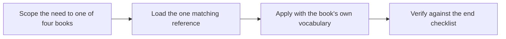
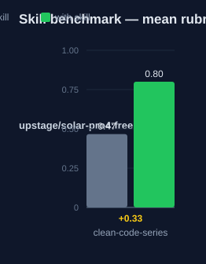

# clean-code-series — Human Guide

This skill is a knowledge base distilled from Robert C. Martin's four Clean
books. It holds frameworks, decision rules, and anti-patterns with chapter
references. It is not a copy of the books.

## What this skill does

The skill answers questions in four steps. First, it scopes the need to one
of the four books: Clean Code for craft, The Clean Coder for professional
conduct, Clean Architecture for structure, Clean Agile for process. Second,
it loads only the one reference file that matches. Third, it applies the
material with the book's own terms, such as SOLID, the Dependency Rule, and
the Three Laws of TDD. Fourth, it verifies the work against the checklist at
the end of each reference. A step is done only when every rule is applied or
waived with a reason. The skill has `disable-model-invocation` set, so it
loads only when a task touches the material.

## Why use this skill

Use this skill when you review or write code and need the Clean Code rules
for naming, functions, and smells. Use it for professional judgment calls
such as estimates and time under pressure. Use it when you design or
critique system structure with SOLID and boundaries. Use it for agile
process questions.

## When not to use

Do not use this skill as a background overlay for unrelated work. It loads
on demand only. Do not load all four references up front. Load one per
question. When a judgment call turns on exact wording, the book is the
authority, not these notes.

## How the skill works

## Measured impact

We ran a with/without benchmark. A clean base agent got the task. The base
agent has no skills and no tools. The same agent then got the task with this
skill's documentation. A deterministic rubric scored each answer. We ran each
arm three times.

| Arm | Score |
|---|---|
| Without skill | 0.47 |
| With skill | **0.80** (+0.33) |

Method: SkillsBench-style A/B. The model is upstage/solar-pro4:free. The rubric and the
runner stay internal. Any clean base agent with the same prompts can
reproduce these results.
